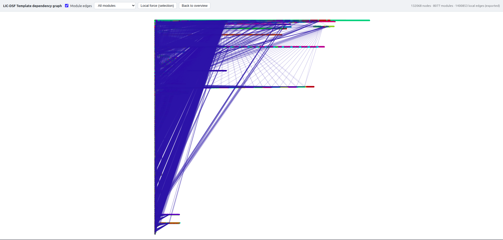
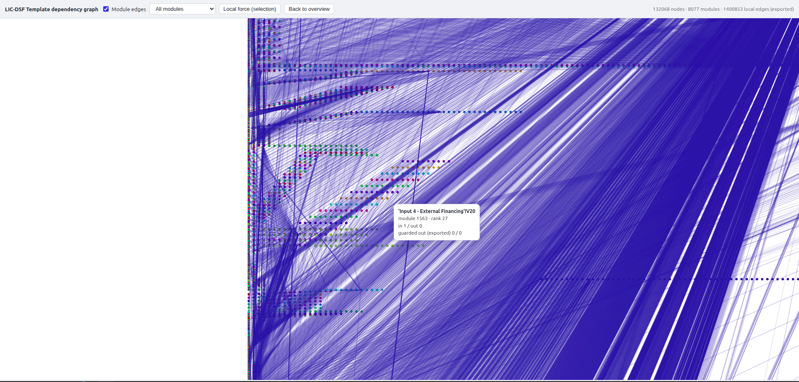

## `excel-grapher`

Build and analyze dependency graphs from Excel workbooks, **evaluate formulas with Excel semantics**, and **export standalone Python code**.

### Why this exists

- **Transpilation support**: trace formula dependencies to enable Excel → Python translation.
- **Interpretability**: visualize and sanity-check spreadsheet logic (GraphViz, Mermaid, NetworkX).
- **Performance-minded**: focuses on targeted dependency closure from specific output cells/ranges.
- **Excel semantics in Python**: run workbook logic in-process with a full Excel-like evaluator.
- **Exportable**: emit standalone Python packages that embed only the runtime surface you need.

---

### Library layout

The unified distribution is `excel-grapher` and exposes a single import package, `excel_grapher`, with four main subpackages:

- `excel_grapher/core/` — shared semantic types, coercions, and scalar operators.
- `excel_grapher/grapher/` — graph-building, validation, and workbook-loading logic.
- `excel_grapher/evaluator/` — evaluator runtime and `FormulaEvaluator`, plus codegen/export runtime for embedding.
- `excel_grapher/exporter/` — public export API (re-exports `CodeGenerator` and export helpers from `evaluator`).

Typical imports:

```python
from excel_grapher.grapher import create_dependency_graph, DependencyGraph
from excel_grapher.evaluator import FormulaEvaluator
from excel_grapher.exporter import CodeGenerator
from excel_grapher.core import XlError  # and other shared types, if needed
```

There are no compatibility shims for the old `excel_evaluator` / standalone `excel_grapher` packages; callers should update to the new import paths.

---

### Installation

This is a proprietary package. Install from the private GitHub repository:

**Using `uv` (recommended):**

```bash
# Basic install
uv add git+https://github.com/Teal-Insights/excel-grapher

# With NetworkX support
uv add "excel-grapher[networkx] @ git+https://github.com/Teal-Insights/excel-grapher"

# With all optional dependencies
uv add "excel-grapher[all] @ git+https://github.com/Teal-Insights/excel-grapher"
```

**Using `pip`:**

```bash
pip install git+https://github.com/Teal-Insights/excel-grapher

# With extras:
pip install "excel-grapher[networkx] @ git+https://github.com/Teal-Insights/excel-grapher"
```

> **Note:** You must have access to the Teal-Insights GitHub organization and appropriate SSH keys or tokens configured.

---

### High-level usage

The library supports a three-stage pipeline:

1. **Build a dependency graph** from an Excel workbook (`excel_grapher.grapher`).
2. **Evaluate formulas with Excel semantics** over that graph (`excel_grapher.evaluator.FormulaEvaluator`).
3. **Export standalone Python code** that embeds only the required runtime surface (`excel_grapher.exporter.CodeGenerator`).

A minimal end‑to‑end example:

```python
from pathlib import Path

from excel_grapher.grapher import create_dependency_graph
from excel_grapher.evaluator import FormulaEvaluator
from excel_grapher.exporter import CodeGenerator

workbook_path = Path("model.xlsx")
targets = ["Sheet1!A10"]

# 1) Build a dependency graph
graph = create_dependency_graph(workbook_path, targets, load_values=True)
print(len(graph))  # number of visited nodes

# 2) Evaluate with Excel semantics
with FormulaEvaluator(graph) as ev:
    results = ev.evaluate(targets)

# 3) Export standalone Python code
code = CodeGenerator(graph).generate(targets)
```

The sections below go into more detail.

---

## 1. Dependency graphs (`excel_grapher.grapher`)

### Key design decisions

- **Node identity**: nodes are keyed by sheet-qualified A1 strings like `Sheet1!A1` (`NodeKey`).
- **Edge direction**: an edge `A -> B` means **A depends on B** (dependency-first evaluation).
- **Leaf definition**: a leaf is any non-formula cell (`Node.is_leaf=True`).
- **Values are optional**: `load_values=True` loads cached Excel results (second workbook load); otherwise formula nodes have `value=None`.
- **Extensible metadata**: each `Node` has a `metadata: dict[str, Any]` that hooks can mutate.
- **Range expansion**: ranges like `A1:A10` are expanded to individual cell dependencies (bounded by `max_range_cells`).
- **Normalized formulas**: each formula node has a `normalized_formula` field with sheet-qualified refs, resolved named ranges, and stripped `$` markers — ready for transpilation.

### Quick start: building a graph

```python
from pathlib import Path

from excel_grapher.grapher import create_dependency_graph
from excel_grapher.grapher import to_graphviz, to_mermaid, to_networkx  # optional

wb_path = Path("model.xlsx")
targets = ["Sheet1!A10"]

g = create_dependency_graph(wb_path, targets, load_values=False)
print(len(g))          # number of visited nodes
print(to_graphviz(g))  # GraphViz DOT
```

### Dynamic OFFSET/INDIRECT configuration

Dynamic references (e.g. `OFFSET`, `INDIRECT`) can be handled in three ways via the `create_dependency_graph` API:

```python
from excel_grapher.grapher import create_dependency_graph, DynamicRefConfig, DynamicRefLimits

# Signature (simplified):
# create_dependency_graph(
#     workbook_path,
#     targets,
#     *,
#     dynamic_refs: DynamicRefConfig | None = None,
#     use_cached_dynamic_refs: bool = False,
#     ...
# )
```

- **`use_cached_dynamic_refs=True`**  
  Use the existing cached-workbook path for `OFFSET`/`INDIRECT`. This preserves the legacy behavior and **ignores** `dynamic_refs`.

- **`use_cached_dynamic_refs=False` (default) and `dynamic_refs is None`**  
  When the builder encounters dynamic refs that require resolution, it raises **`DynamicRefError`**. This is the safe “no silent fallback” default.

- **`use_cached_dynamic_refs=False` and `dynamic_refs is a DynamicRefConfig`**  
  Resolve dynamic refs using static constraints (cell types and limits). Missing or invalid domains still raise `DynamicRefError`.

You typically build a `DynamicRefConfig` from a TypedDict of constraints:

```python
from typing import TypedDict

from excel_grapher.grapher import DynamicRefConfig, create_dependency_graph

class DynamicConstraints(TypedDict):
    # Keys are address-style cell addresses, e.g. "Sheet1!B1"
    Sheet1_B1: str
    Sheet1_C1: float

constraints = DynamicConstraints(
    Sheet1_B1="ROW_INDEX",
    Sheet1_C1=1.0,
)

config = DynamicRefConfig.from_constraints(DynamicConstraints, constraints)

graph = create_dependency_graph(
    "model_with_dynamic_refs.xlsx",
    ["Sheet1!D10"],
    load_values=False,
    dynamic_refs=config,
    # use_cached_dynamic_refs=False is the default
)
```

Key points:

- Constraint keys use **address-style** strings (e.g. `"Sheet1!B1"`).
- `DynamicRefConfig` is immutable and carries both the `cell_type_env` and `DynamicRefLimits`.
- From the top-level package, you can import `DynamicRefConfig`, `DynamicRefLimits`, and `DynamicRefError`.

### Working with cell data (for transpilation)

The `DependencyGraph` provides direct O(1) access to cell data via `get_node()`, plus filter methods for iterating over formula vs. leaf cells.

```python
from pathlib import Path

from excel_grapher.grapher import create_dependency_graph, discover_formula_cells_in_rows
from excel_grapher.grapher import DependencyGraph

# Discover formula cells in specific rows
targets = discover_formula_cells_in_rows(Path("model.xlsx"), "Sheet1", [10, 11, 12])

# Build the dependency graph
graph: DependencyGraph = create_dependency_graph(Path("model.xlsx"), targets, load_values=True)

# Access cells by normalized address (O(1) lookup)
node = graph.get_node("Sheet1!A10")
print(node.formula)             # Original formula
print(node.normalized_formula)  # Sheet-qualified for transpilation
print(node.value)               # Cached value from Excel

# Iterate over formula cells
for key, node in graph.formula_nodes():
    print(key, node.normalized_formula)

# Iterate over leaf (value) cells
for key, node in graph.leaf_node_items():
    print(key, node.value)

# Get sorted keys
formula_keys = graph.formula_keys()
leaf_keys = graph.leaf_keys()
```

#### `DependencyGraph` filter methods

| Method              | Returns                               | Description                           |
|---------------------|----------------------------------------|---------------------------------------|
| `get_node(key)`     | `Node \| None`                       | O(1) lookup by cell address           |
| `formula_nodes()`   | `Iterator[tuple[NodeKey, Node]]`     | Cells with formulas                   |
| `leaf_node_items()` | `Iterator[tuple[NodeKey, Node]]`     | Leaf cells (no formula)               |
| `formula_keys()`    | `list[NodeKey]`                      | Sorted keys for formula cells         |
| `leaf_keys()`       | `list[NodeKey]`                      | Sorted keys for leaf cells            |

#### `Node` fields

| Field                | Type         | Description                               |
|----------------------|--------------|-------------------------------------------|
| `formula`            | `str \| None` | Original formula (None for leaf cells)  |
| `normalized_formula` | `str \| None` | Sheet-qualified formula for transpilation |
| `value`              | `Any`         | Cached or hardcoded value               |
| `is_leaf`            | `bool`        | True if cell has no formula             |
| `sheet`              | `str`         | Sheet name                              |
| `column`             | `str`         | Column letter                           |
| `row`                | `int`         | Row number                              |

#### `discover_formula_cells_in_rows()`

Utility for scanning rows to find formula cells with numeric cached values:

```python
def discover_formula_cells_in_rows(
    wb_path: Path,
    sheet_name: str,
    rows: list[int],
) -> list[str]:
    ...
```

Returns sheet-qualified cell addresses (e.g., `"'Sheet Name'!A1"`) for formula cells.

---

## 2. Visualizing and exporting graphs

### GraphViz DOT

```python
from excel_grapher.grapher import to_graphviz

dot = to_graphviz(g, rankdir="LR")
```

### Mermaid

```python
from excel_grapher.grapher import to_mermaid

mm = to_mermaid(g, max_nodes=100)
```

### NetworkX (optional dependency)

```python
from excel_grapher.grapher import to_networkx

G = to_networkx(g)
```

### Large graphs: lightweight WebGL viewer

For graphs that are too large for Graphviz or Mermaid, build a **columnar** payload and open the generated HTML in a browser (no Node/npm build). The overview uses rank-based layout and module summaries; raw cell-to-cell edges are exported only in bounded **local** neighborhoods. Optional **local force** layout runs in the browser on small subgraphs only.

```python
from pathlib import Path

from excel_grapher.grapher import (
    create_dependency_graph,
    to_lightweight_viz,
    write_lightweight_viz_data,
    write_lightweight_viz_html,
)

g = create_dependency_graph("model.xlsx", ["Sheet1!A1"], load_values=False)
payload = to_lightweight_viz(g)
write_lightweight_viz_data(payload, Path("model.viz.json"))
write_lightweight_viz_html(payload, Path("model.html"), data_mode="auto")
```

`write_lightweight_viz_html(..., data_mode="auto")` inlines JSON when the estimated payload is at most **50 MiB** (override with `inline_size_budget_mb`); otherwise it writes a sidecar `.viz.json` next to the HTML. Stats on truncation and density are in `payload.stats`.

To refresh the checked-in LIC-DSF sample viewer:

```bash
uv run example/regenerate_sample_viz.py --full
```

This rebuilds `example/data/lic-dsf-template-sample-exported-viz.html` from the cached dependency graph in `example/.cache/`. If you only changed the HTML template and want to re-embed the current `lightweight_viz_template.html` without rebuilding the payload, run:

```bash
uv run example/regenerate_sample_viz.py
```

Open the exported HTML directly in a browser. The interface supports panning, zooming, module filtering, module-edge overlays, hover tooltips, and a local force-layout mode for inspecting a bounded neighborhood without trying to force-layout the entire workbook.

#### Example interface





#### Interpreting the overview for module inference

The overview is most useful as a **module-finding aid** for generated-library design, not as a literal geometric embedding of workbook logic. Color primarily indicates inferred module membership. Horizontal position is the important structural axis: farther right usually means more upstream precedent-like logic, while farther left usually means more downstream consumer, output, or report logic.

When reading the graph:

- A same-color band that spans several X slices is a strong candidate for one extracted library module, especially if it has relatively few blue inter-module lines leaving it.
- A same-color cluster all in one narrow X slice is often just a batch of parallel formulas at one stage, not necessarily a full standalone boundary, though it may still be patternized into a small helper for deduplication.
- Modules on the far right are good candidates for shared primitives, base calculations, normalization, lookups, or assumptions.
- Modules on the far left are more likely report assembly, presentation logic, or output-specific composition.
- A module with heavy fan-in and fan-out across many colors is probably cross-cutting glue, not a clean package boundary.
- If you see several adjacent same-color or tightly coupled colors stepping left-to-right, that often suggests a higher-level package split rather than one tiny module per color.

Some caution is warranted when interpreting the picture:

- The Y axis mainly separates module bands and reduces overplotting; vertical proximity is much less semantically important than horizontal position.
- Similar colors do not imply similar semantics; color is just a deterministic visual label for `module_id`.
- The blue overlay lines show module-to-module connectivity, which is useful for spotting coupling hot spots, but they are summary edges rather than a complete rendering of every cell-to-cell dependency.
- The `Force` button is for local inspection only. Use the `Overview` view, not the force-layout view, when reasoning about global library boundaries.

### Validation via `calcChain.xml`

You can validate the graph against Excel’s `calcChain.xml`:

```python
from pathlib import Path

from excel_grapher.grapher import create_dependency_graph, validate_graph

g = create_dependency_graph("model.xlsx", ["Sheet1!A10"], load_values=False)
res = validate_graph(g, Path("model.xlsx"), scope={"Sheet1"})
print(res.is_valid, res.messages)
```

If `xl/calcChain.xml` is missing (common for generated files), validation returns `is_valid=True` with an informational message.

---

## 3. Evaluating formulas (`excel_grapher.evaluator`)

The evaluator implements Excel’s semantics in Python and runs over a `DependencyGraph`.

### Conceptually

- `FormulaEvaluator` is a wrapper around `DependencyGraph` that:
  - Translates Excel formulas to Python at runtime.
  - Provides Python equivalents for Excel functions, operators, and error types.
  - Handles circular references in a way compatible with Excel’s defaults (warn + return `0`, etc.).
  - Caches results to ensure each cell is computed at most once in a given evaluation.

This gives **fast, accurate, repeatable** execution for any given workbook, but keeps the logic in an Excel-shaped representation. It’s the easiest path when you want to:

- Re-extract and re-run a computation whenever the workbook changes.
- Keep a tight coupling to Excel while still running logic in Python.

### Minimal evaluator example

```python
from excel_grapher.grapher import create_dependency_graph
from excel_grapher.evaluator import FormulaEvaluator

targets = ["Sheet1!B10"]

graph = create_dependency_graph(
    "model.xlsx",
    targets,
    load_values=True,
    max_depth=10,
)

with FormulaEvaluator(graph) as ev:
    evaluator_results = ev.evaluate(targets)

print(evaluator_results)
# {'Sheet1!B10': ...}
```

---

## 4. End-to-end demo: synthetic two-cell workbook

This example builds a **synthetic two-cell workbook** and runs it through the full pipeline.

- `S!A1` is a leaf value (`10`).
- `S!B1` is a formula (`=A1*2`) that references `S!A1`.

### Setup: create the workbook

```python
from __future__ import annotations

import sys
from pathlib import Path

import fastpyxl


def _find_repo_root(start: Path) -> Path:
    for p in [start, *start.parents]:
        if (p / "pyproject.toml").exists():
            return p
    raise RuntimeError("Could not find repo root (missing pyproject.toml)")


def create_synthetic_workbook(path: Path, *, sheet_name: str = "S") -> None:
    path.parent.mkdir(parents=True, exist_ok=True)

    wb = fastpyxl.Workbook()
    ws = wb.active
    ws.title = sheet_name

    ws["A1"].value = 10
    ws["B1"].value = "=A1*2"

    wb.save(path)


ROOT = _find_repo_root(Path.cwd())
sys.path.insert(0, str(ROOT))

workbook_path = ROOT / "demo" / "_artifacts" / "two_cell_demo.xlsx"
create_synthetic_workbook(workbook_path, sheet_name="S")
```

### Build the `DependencyGraph` (dict representation)

```python
import json
from dataclasses import asdict

from excel_grapher.grapher import create_dependency_graph, DependencyGraph
from excel_grapher.evaluator import FormulaEvaluator
from excel_grapher.exporter import CodeGenerator

targets = ["S!B1"]
graph: DependencyGraph = create_dependency_graph(
    workbook_path,
    targets,
    load_values=True,
    max_depth=10,
)

def serialize_graph(graph: DependencyGraph) -> dict:
    return {
        "nodes": {k: asdict(v) for k, v in graph._nodes.items()},
        # Adjacency list: node -> dependencies (edges point from node to its deps)
        "edges": {k: sorted(v) for k, v in graph._edges.items()},
    }

print(json.dumps(serialize_graph(graph), indent=2, sort_keys=True))
```

Example output:

```json
{
  "edges": {
    "S!A1": [],
    "S!B1": [
      "S!A1"
    ]
  },
  "nodes": {
    "S!A1": {
      "column": "A",
      "formula": null,
      "is_leaf": true,
      "metadata": {},
      "normalized_formula": null,
      "row": 1,
      "sheet": "S",
      "value": 10
    },
    "S!B1": {
      "column": "B",
      "formula": "=A1*2",
      "is_leaf": false,
      "metadata": {},
      "normalized_formula": "=S!A1*2",
      "row": 1,
      "sheet": "S",
      "value": null
    }
  }
}
```

### Evaluator results

```python
with FormulaEvaluator(graph) as ev:
    evaluator_results = ev.evaluate(targets)

print(evaluator_results)
# {'S!B1': 20.0}
```

### Caching an extracted graph (optional)

If graph extraction is expensive and you expect to re-use the same workbook + targets + extraction settings,
you can cache the `DependencyGraph` to disk as JSON.

Strict caching (requires access to the workbook file to validate fingerprints):

```python
from pathlib import Path

from excel_grapher import (
    CacheValidationPolicy,
    build_graph_cache_meta,
    create_dependency_graph,
    save_graph_cache,
    try_load_graph_cache,
)

workbook_path = Path("workbook.xlsx")
targets = ["S!B1"]
extraction_params = {"load_values": True, "max_depth": 50}

expected = build_graph_cache_meta(workbook_path, targets, extraction_params=extraction_params)
graph = try_load_graph_cache(Path("graph-cache.json"), expected_meta=expected)
if graph is None:
    graph = create_dependency_graph(workbook_path, targets, **extraction_params)
    save_graph_cache(Path("graph-cache.json"), graph, expected)
```

Portable caching (for `FormulaEvaluator` on machines without the workbook file):

```python
from excel_grapher import (
    CacheValidationPolicy,
    build_graph_cache_meta_portable,
    try_load_graph_cache,
)

targets = ["S!B1"]
expected = build_graph_cache_meta_portable(targets, extraction_params={"load_values": True, "max_depth": 50})

graph = try_load_graph_cache(
    Path("graph-cache.json"),
    expected_meta=expected,
    policy=CacheValidationPolicy.PORTABLE,
)
if graph is None:
    raise FileNotFoundError("No valid cached graph found for the requested targets/settings.")
```

**Tradeoffs for the evaluator approach:**

- **Advantages**
  - **Native interface for extraction**: easy to re-extract and re-run if the workbook changes.
  - **Template flexibility**: users can alter workbook structure; re-extraction will follow the new formula graph.
- **Disadvantages**
  - **Runtime translation**: Excel → Python translation happens at runtime for each evaluation.
  - **Coupled to Excel**: still conceptually “driven by Excel” rather than a fully normalized Python model.

---

## 5. Exporting standalone Python (`excel_grapher.exporter`)

The exporter turns a `DependencyGraph` into a standalone Python module:

```python
from excel_grapher.exporter import CodeGenerator

code = CodeGenerator(graph).generate(targets)
print("\n".join(code.splitlines()[:120]))
```

You can also emit named entrypoints by passing a mapping of names to target lists:

```python
code = CodeGenerator(graph).generate(
    targets,
    entrypoints={
        "outputs": ["S!B1", "S!C1"],
        "checks": ["S!D1"],
    },
)
```

This generates `compute_outputs(...)` and `compute_checks(...)` alongside `compute_all(...)`.

A (truncated) sketch of the exported code:

```python
"""Standalone runtime for generated Excel formula code."""

from __future__ import annotations

from enum import Enum


class XlError(str, Enum):
    """Excel error values."""
    VALUE = "#VALUE!"
    REF = "#REF!"
    DIV = "#DIV/0!"
    NA = "#N/A"
    NAME = "#NAME?"
    NUM = "#NUM!"
    NULL = "#NULL!"


def to_number(value) -> float | XlError:
    ...


def xl_mul(left, right) -> float | XlError:
    ...


from functools import lru_cache


# --- Cell functions ---

@lru_cache(maxsize=None)
def cell_s_a1():
    """Leaf cell: S!A1"""
    return 10


@lru_cache(maxsize=None)
def cell_s_b1():
    """Formula: =A1*2"""
    return xl_mul(cell_s_a1(), 2.0)


def compute_all():
    """Compute all target cells and return results."""
    return {
        "S!B1": cell_s_b1(),
    }
```

### Exported code results

```python
namespace: dict = {}
exec(code, namespace)
generated_results = namespace["compute_all"]()
print(generated_results)
# {'S!B1': 20.0}
```

**Tradeoffs for the exported-code approach:**

- **Advantages**
  - **Standalone artifact**: output is plain Python; no need to distribute `excel_grapher` or the evaluator with it.
  - **Partial obfuscation**: does not expose the extraction engine directly.
  - **Minimal runtime surface**: embeds only the Excel-equivalent `xl_*` helpers actually needed by the exported graph.
  - **Repeatable execution**: freezes workbook logic at a point in time; downstream runs are deterministic and Excel-free.
- **Disadvantages**
  - **Still Excel-shaped**: the structure is still cell-centric and Excel-like; interpretability gains are incremental.
  - **Regeneration required**: changes to the workbook require re-extracting and re-exporting.

---

## 6. Roadmap

- Continue expanding parity tests between the evaluator runtime and export runtime, especially for representation-sensitive areas such as `OFFSET`, `INDIRECT`, `LOOKUP`, `MATCH`, and `INDEX`.
- Refine the dynamic-reference configuration API and constraints tooling (e.g., better TypedDict ergonomics, validation helpers) as more real-world models and templates are integrated.