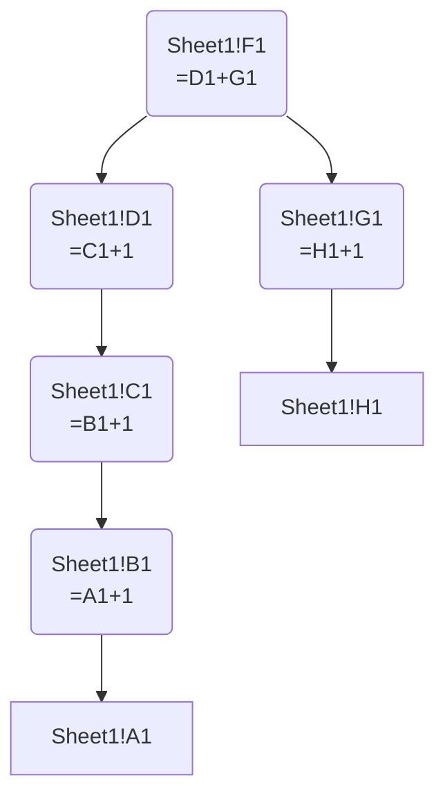
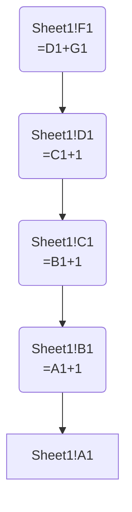

# Full vs Path-Induced Mermaid Graphs


This example shows the difference between:

1.  exporting the full dependency graph for a target cell, and
2.  exporting an induced subgraph containing only nodes on directed
    paths between two node sets.

The workbook is [`induced_graph.xlsx`](induced_graph.xlsx).

``` python
from pathlib import Path

from excel_grapher.grapher import (
    create_dependency_graph,
    select_path_induced_subgraph,
    to_mermaid,
)

workbook_path = Path("induced_graph.xlsx")
full_graph = create_dependency_graph(workbook_path, ["Sheet1!F1"], load_values=False)

print(f"```text\nFull graph node count: {len(full_graph)}\n```")
```

``` text
Full graph node count: 7
```

`Sheet1!F1` depends on two branches: - `F1 -> D1 -> C1 -> B1 -> A1` -
`F1 -> G1 -> H1`

If we export the full graph, both branches appear.

``` python
print(f"```mermaid\n{to_mermaid(full_graph, max_nodes=100)}\n```")
```



Now isolate only nodes on directed paths from `Sheet1!F1` to
`Sheet1!A1`.

``` python
induced_graph = select_path_induced_subgraph(
    full_graph,
    source_keys=["Sheet1!F1"],
    target_keys=["Sheet1!A1"],
)

print(f"```text\nInduced graph node count: {len(induced_graph)}\n```")
```

``` text
Induced graph node count: 5
```

``` python
print(f"```mermaid\n{to_mermaid(induced_graph, max_nodes=100)}\n```")
```



The induced graph excludes the unrelated branch (`G1 -> H1`) because
those nodes are not on any directed path from `F1` to `A1`.
