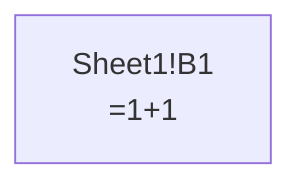
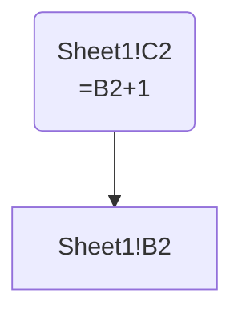
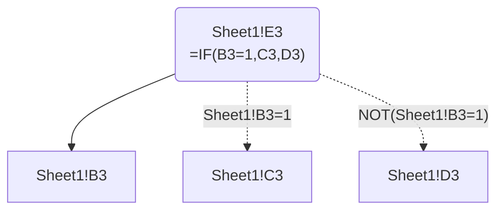
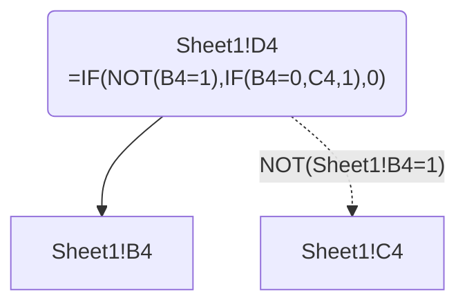
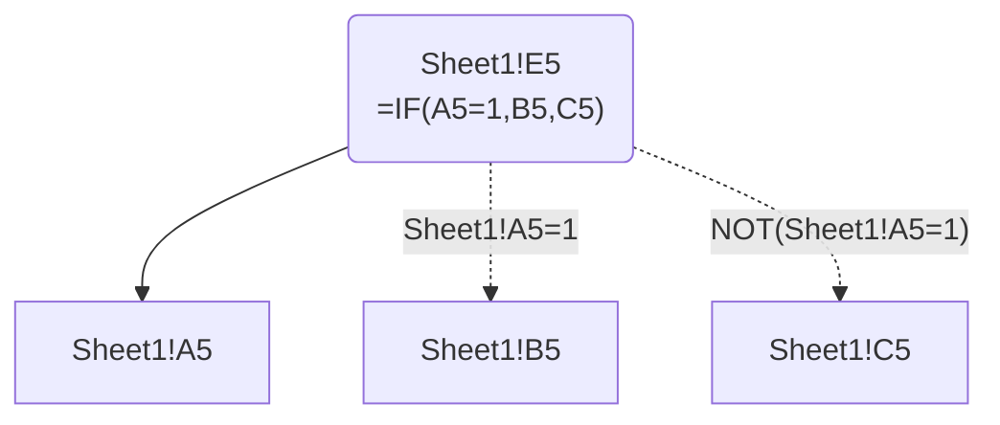
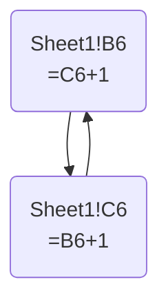
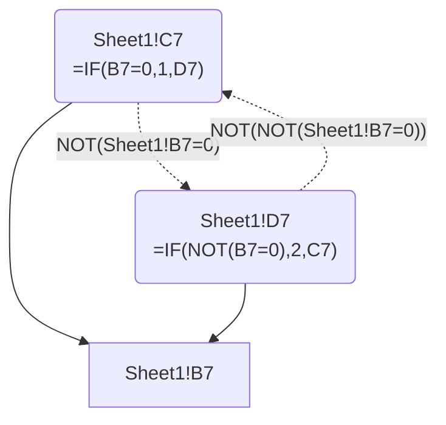
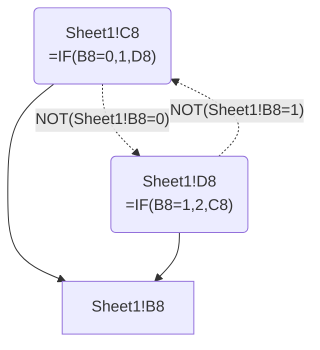

# Consolidated Micro-Workbook Graph Examples


Each row of
[examples/micro-workbook/example-cases.xlsx](example-cases.xlsx)
contains a self-contained example that can be extracted as a graph. This
workbook demonstrates the workflow and application behavior for
different Excel dependency scenarios.

``` python
from pathlib import Path
from pprint import pformat

from excel_grapher.grapher import (
    create_dependency_graph, DependencyGraph, to_mermaid
)
from excel_grapher.evaluator import FormulaEvaluator

# Load the example workbook
workbook_path = Path("example-cases.xlsx")

# Define helper functions to print the graph object and Mermaid diagram
def print_text(text: str):
    print("```text")
    print(text)
    print("```\n")

def print_mermaid(graph: DependencyGraph):
    mermaid = to_mermaid(graph)

    print("```mermaid")
    print(mermaid)
    print("```\n")
```

## 01. Formula with no dependencies

The first example is a single-cell formula with no dependencies. We can
extract the graph with the `create_dependency_graph` function. This
returns a `DependencyGraph` object, which we can pretty-print using the
helper defined above.

``` python
graph: DependencyGraph = create_dependency_graph(workbook_path, ["Sheet1!B1"], load_values=False)

print_text(pformat(graph, indent=4, width=100))
```

``` text
DependencyGraph(_nodes={   'Sheet1!B1': Node(sheet='Sheet1',
                                             column='B',
                                             row=1,
                                             formula='=1+1',
                                             normalized_formula='=1+1',
                                             value=None,
                                             is_leaf=True,
                                             metadata={})},
                _edges={'Sheet1!B1': set()},
                _reverse_edges={'Sheet1!B1': set()},
                _guards={},
                _edge_extra={},
                _hooks=[],
                leaf_classification=None)
```

If we render this to Mermaid, we can see that it is a single-node graph
with no dependencies.

``` python
print_mermaid(graph)
```



## 02. Linear dependency

The second example consists of two cells: one hardcoded and one a
formula that depends on the hardcoded cell.

``` python
graph: DependencyGraph = create_dependency_graph(workbook_path, ["Sheet1!C2"], load_values=True)

print_mermaid(graph)
```



The default value of “Sheet1!B2” is `1` and the formula is `=B2+1`, so
the Excel-cached value of “Sheet1!C2” is `2`, as we can see on the
node’s value field. We can use `get_node` for a read-only view of the
node:

``` python
node = graph.get_node("Sheet1!C2")
print_text(str(node.value))
```

``` text
2
```

We can also use `get_dependencies` to get the dependencies of the node:

``` python
dependencies = graph.get_dependencies("Sheet1!C2")
print_text(str(dependencies))
```

``` text
frozenset({'Sheet1!B2'})
```

What would “Sheet1!C2” evaluate to if we set the value of “Sheet1!B2” to
`2`? We can find out by changing its value with `set_node_value`, then
passing the graph to `FormulaEvaluator` for recomputation:

``` python
graph.set_node_value("Sheet1!B2", 2)

with FormulaEvaluator(graph) as evaluator:
    value = evaluator.evaluate("Sheet1!C2")
    print_text(str(value))
```

``` text
3.0
```

Under the hood, `FormulaEvaluator` parses the graph’s Excel formulas and
translates them to Python, then evaluates them in the context of the
graph.

## 03. Conditional branches

``` python
graph: DependencyGraph = create_dependency_graph(workbook_path, ["Sheet1!E3"], load_values=False)

print_mermaid(graph)
```



## 04. Nested conditional in a cell

``` python
graph: DependencyGraph = create_dependency_graph(workbook_path, ["Sheet1!D4"], load_values=False)

print_mermaid(graph)
```



## 05. Nested conditional across cells

``` python
graph: DependencyGraph = create_dependency_graph(workbook_path, ["Sheet1!E5"], load_values=False)

print_mermaid(graph)
```



## 06. Will cycle

``` python
graph: DependencyGraph = create_dependency_graph(workbook_path, ["Sheet1!C6"], load_values=False)

print_mermaid(graph)
```



## 07. Won’t cycle

``` python
graph: DependencyGraph = create_dependency_graph(workbook_path, ["Sheet1!C7"], load_values=False)

print_mermaid(graph)
```



## 08. May cycle

``` python
graph: DependencyGraph = create_dependency_graph(workbook_path, ["Sheet1!C8"], load_values=False)

print_mermaid(graph)
```


