# Consolidated Micro-Workbook Basic Graph Extraction Examples


Each row of
[examples/micro_workbooks/extraction_basics.xlsx](extraction_basics.xlsx)
contains a self-contained example that can be extracted as a graph. This
workbook demonstrates the workflow and application behavior for
different Excel dependency scenarios.

``` python
from pathlib import Path
from pprint import pformat

from excel_grapher.grapher import create_dependency_graph, to_mermaid, DependencyGraph
from excel_grapher.evaluator import FormulaEvaluator
from excel_grapher.exporter import CodeGenerator

# Load the example workbook
workbook_path = Path("extraction_basics.xlsx")


# Define helper functions to print the graph object and Mermaid diagram
def print_text(text: str):
    print("```text")
    print(text)
    print("```\n")


def print_mermaid(graph: DependencyGraph):
    mermaid = to_mermaid(graph)

    print("```mermaid")
    print(mermaid)
    print("```\n")
```

## 01. Formula with no dependencies

The first example is a single-cell formula with no dependencies. We can
extract the graph with the `create_dependency_graph` function. This
returns a `DependencyGraph` object, which we can pretty-print using the
helper defined above.

``` python
graph: DependencyGraph = create_dependency_graph(workbook_path, ["Sheet1!B1"], load_values=False)

print_text(pformat(graph, indent=4, width=100))
```

``` text
DependencyGraph(_nodes={   'Sheet1!B1': Node(sheet='Sheet1',
                                             column='B',
                                             row=1,
                                             formula='=1+1',
                                             normalized_formula='=1+1',
                                             value=None,
                                             is_leaf=True,
                                             is_target=True,
                                             metadata={},
                                             kind=<NodeKind.cell: 'cell'>,
                                             min_col='B',
                                             min_row=1,
                                             max_col='B',
                                             max_row=1,
                                             address='Sheet1!B1')},
                _edges={'Sheet1!B1': set()},
                _reverse_edges={'Sheet1!B1': set()},
                _guards={},
                _edge_provenance={},
                _hooks=[],
                _occupancy={'Sheet1!B1': 'Sheet1!B1'},
                leaf_classification=None,
                sheet_order=['Sheet1'],
                sheet_bounds={'Sheet1': (11, 5)},
                named_ranges={},
                named_range_ranges={'MyNamedRange': ('Sheet1', 'C11', 'D11')},
                preparsed_formulas=None)
```

If we render this to Mermaid, we can see that it is a single-node graph
with no dependencies.

``` python
print_mermaid(graph)
```

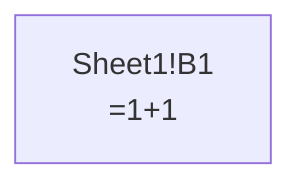

## 02. Linear dependency

The second example consists of two cells: one hardcoded and one a
formula that depends on the hardcoded cell.

``` python
graph: DependencyGraph = create_dependency_graph(workbook_path, ["Sheet1!C2"], load_values=True)

print_mermaid(graph)
```

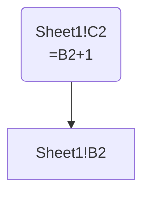

The default value of “Sheet1!B2” is `1` and the formula is `=B2+1`, so
the Excel-cached value of “Sheet1!C2” is `2`, as we can see on the
node’s value field. We can use `get_node` for a read-only view of the
node:

``` python
node = graph.get_node("Sheet1!C2")
print_text(str(node.value))
```

``` text
2
```

We can also use `get_dependencies` to get the dependencies of the node:

``` python
dependencies = graph.get_dependencies("Sheet1!C2")
print_text(str(dependencies))
```

``` text
frozenset({'Sheet1!B2'})
```

What would “Sheet1!C2” evaluate to if we set the value of “Sheet1!B2” to
`2`? We can find out by changing its value with `set_node_value`, then
passing the graph to `FormulaEvaluator` (an Excel emulator) for
recomputation:

``` python
graph.set_node_value("Sheet1!B2", 2)

with FormulaEvaluator(graph) as evaluator:
    value = evaluator.evaluate("Sheet1!C2")
    print_text(str(value))
```

``` text
3.0
```

Under the hood, `FormulaEvaluator` parses the graph’s Excel formulas and
translates them to Python, then evaluates them in the context of the
graph. The computed value of “Sheet1!C2” is `3`.

Since `set_node_value` permanently changed the value of “Sheet1!B2” in
the graph to `2`, it will still be `2` subsequent computations using the
graph, and also in any generated code (see [Code Generation
Basics](codegen_basics.md) for more details).

## 03. Conditional branches

When extracting the dependencies of conditional Excel functions such as
`IF`, `SWITCH`, and `CHOOSE`, `excel-grapher` will “guard” the edges
with a logical condition. Visualization tools such as Mermaid mostly
show guarded edges as dashed lines with labels indicating the guard
condition.

``` python
graph: DependencyGraph = create_dependency_graph(workbook_path, ["Sheet1!E3"], load_values=False)

print_mermaid(graph)
```

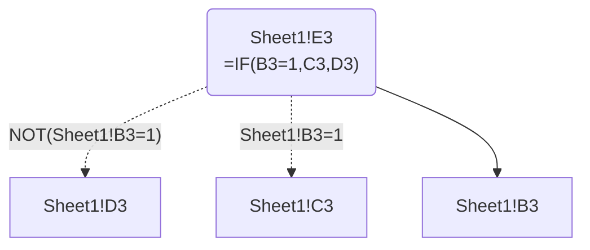

To see the representation of guards in Python, we can inspect the
`_guards` attribute on the graph:

``` python
print_text(pformat(graph._guards, indent=4, width=100))
```

``` text
{   ('Sheet1!E3', 'Sheet1!C3'): Compare(left=CellRef(key='Sheet1!B3'),
                                        op='=',
                                        right=Literal(value=1)),
    ('Sheet1!E3', 'Sheet1!D3'): Not(operand=Compare(left=CellRef(key='Sheet1!B3'),
                                                    op='=',
                                                    right=Literal(value=1)))}
```

The graph object exposes a `get_edge_guard` method to get the guard
expression for a given edge. Printing the returned `GuardExpr` object
gives us an Excel-style interpretation of the guard expression:

``` python
guard = graph.get_edge_guard("Sheet1!E3", "Sheet1!C3")
print_text(str(guard))
```

``` text
Sheet1!B3=1
```

## 04. Nested conditional in a cell

When a conditional is nested inside another conditional’s branch, a
dependency of the inner branch is only reached when every enclosing
condition holds, so its edge guard is the logical `AND` of all of them.
For instance, `=IF(NOT(B4=1),IF(B4=0,C4,1),0)` in “Sheet1!D4” guards the
edge to “Sheet1!C4” with `AND(NOT(Sheet1!B4=1),Sheet1!B4=0)`. This works
to arbitrary nesting depth and across the conditional functions (`IF`,
`IFS`, `CHOOSE`, `SWITCH`). A dependency that is reachable through more
than one branch instead gets its per-branch guards joined by logical
`OR` (and a dependency that also feeds a condition stays unguarded,
since it is always read).

``` python
graph: DependencyGraph = create_dependency_graph(workbook_path, ["Sheet1!D4"], load_values=False)

print_mermaid(graph)
```

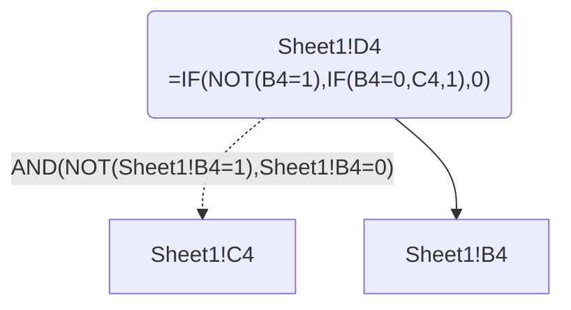

## 05. Nested conditional across cells

Conditional dependencies across cells are supported. For example,
tracing the path between “Sheet1!E3” and “Sheet1!C5” reveals that C5
will be needed to compute E3 only if two conditions are met:
`NOT(Sheet1!A5=1)` and `Sheet1!B5=0`.

``` python
graph: DependencyGraph = create_dependency_graph(workbook_path, ["Sheet1!E5"], load_values=False)

print_mermaid(graph)
```

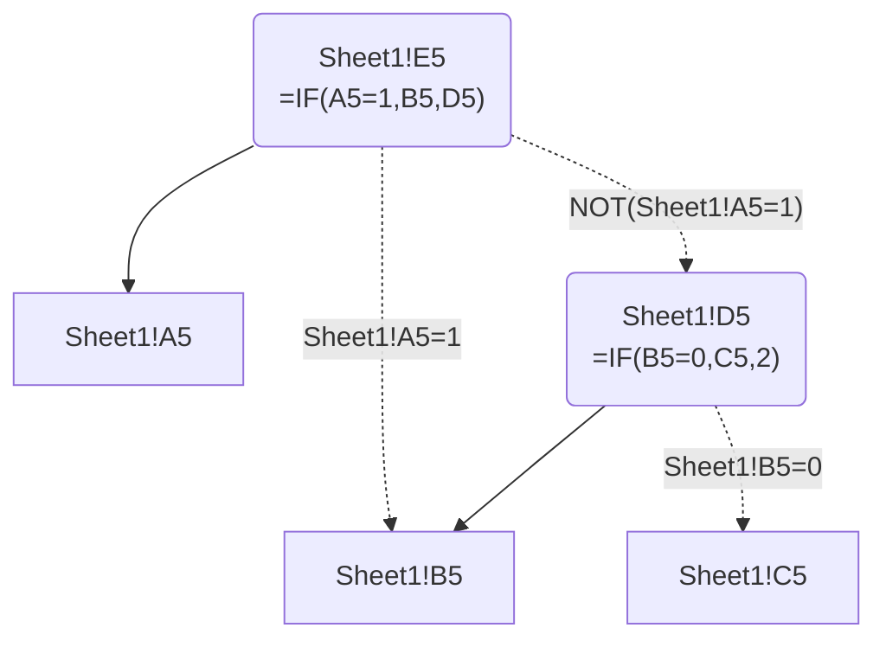

## 06. Must cycle

If formula cells make a cycle, the graph will be extracted successfully,
as dependency traversal stops when it hits an already-visited cell.

``` python
graph: DependencyGraph = create_dependency_graph(workbook_path, ["Sheet1!C6"], load_values=False)

print_mermaid(graph)
```

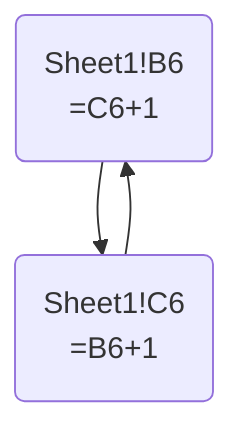

Excel’s internal behavior with respect to cycles is different depending
on workbook settings. If `iterate` is enabled in the workbook, Excel
will iterate over the cycle until it converges on a value or hits a
maximum number of iterations. Otherwise, it will stop and return 0 from
any cell already seen before in a formula chain. In `FormulaEvaluator`,
we replicate this behavior with a `CircularReferenceWarning` unless the
workbook is configured to allow cycles:

``` python
with FormulaEvaluator(graph) as evaluator:
    # Note: warning may not always be emitted due to Quarto caching behavior
    value = evaluator.evaluate("Sheet1!C6")
    print_text(str(value))
```

``` text
2.0
```

    /home/user/excel-grapher/excel_grapher/runtime/cache.py:56: CircularReferenceWarning: Circular reference detected; returning 0 (iterative calculation is disabled).
      warn_circular_reference(stacklevel=2)

For a detailed report on cycles in the graph, we can use the
`cycle_report` method:

``` python
report = graph.cycle_report()
print_text(pformat(report, indent=4, width=100))
```

``` text
CycleReport(has_must_cycles=True,
            has_may_cycles=False,
            must_cycles=[{'Sheet1!C6', 'Sheet1!B6'}],
            may_cycles=[],
            example_must_cycle_path=['Sheet1!C6', 'Sheet1!B6', 'Sheet1!C6'],
            example_may_cycle_path=None)
```

## 07. Won’t cycle

If edge guards involved in a cycle are mutually logically exclusive, the
cycle is broken and does not appear in the cycle report.

``` python
graph: DependencyGraph = create_dependency_graph(workbook_path, ["Sheet1!C7"], load_values=False)

print_mermaid(graph)

report = graph.cycle_report()
print_text(pformat(report, indent=4, width=100))
```

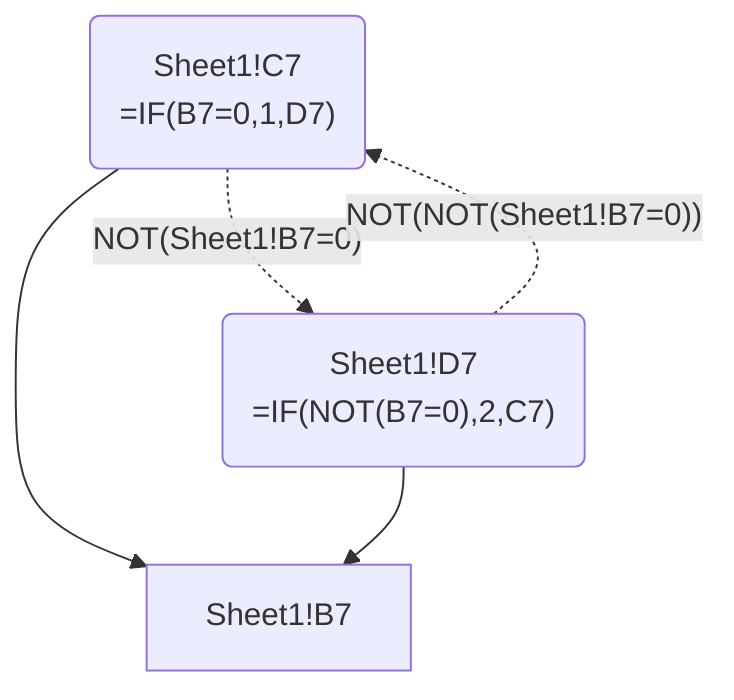

``` text
CycleReport(has_must_cycles=False,
            has_may_cycles=False,
            must_cycles=[],
            may_cycles=[],
            example_must_cycle_path=None,
            example_may_cycle_path=None)
```

## 08. May cycle

Guarded dependencies can form may-cycles. For example, Sheet1!D8 depends
on Sheet1!C8 only if `NOT(Sheet1!B8=1)`, and Sheet1!C8 depends on
Sheet1!D8 only if `NOT(Sheet1!B8=0)`. These guard conditions are
mutually exclusive only if B8 is either 1 or 0. For any other value of
B8 (e.g., `2`), both conditions are true and a cycle will occur. So this
cycle is flagged as a may-cycle in the cycle report.

``` python
graph: DependencyGraph = create_dependency_graph(workbook_path, ["Sheet1!C8"], load_values=False)

print_mermaid(graph)

report = graph.cycle_report()
print_text(pformat(report, indent=4, width=100))
```

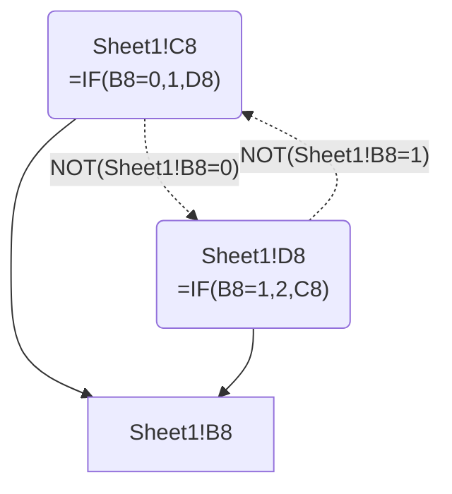

``` text
CycleReport(has_must_cycles=False,
            has_may_cycles=True,
            must_cycles=[],
            may_cycles=[{'Sheet1!D8', 'Sheet1!C8'}],
            example_must_cycle_path=None,
            example_may_cycle_path=['Sheet1!D8', 'Sheet1!C8', 'Sheet1!D8'])
```

If we know from the workbook’s domain that Sheet1!B8 can only ever be
`0` or `1`, the cycle becomes infeasible and should not be reported. The
constraint API expresses this with a `dict[str, type]` mapping
sheet-qualified addresses to typing annotations (e.g. `Literal[...]` or
`Annotated[..., Between(...)]`), then building a `DynamicRefConfig` from
it and passing it to `create_dependency_graph` via the `dynamic_refs`
parameter:

``` python
from typing import Literal

from excel_grapher import DynamicRefConfig


constraints_schema: dict[str, type] = {"Sheet1!B8": Literal[0, 1]}
config = DynamicRefConfig.from_constraints(constraints_schema, {})

graph: DependencyGraph = create_dependency_graph(
    workbook_path, ["Sheet1!C8"], load_values=False, dynamic_refs=config
)

report = graph.cycle_report()
print_text(pformat(report, indent=4, width=100))
```

``` text
CycleReport(has_must_cycles=False,
            has_may_cycles=True,
            must_cycles=[],
            may_cycles=[{'Sheet1!D8', 'Sheet1!C8'}],
            example_must_cycle_path=None,
            example_may_cycle_path=['Sheet1!D8', 'Sheet1!C8', 'Sheet1!D8'])
```

In theory, this constraint should render the cycle infeasible: the
conjunction of guards `NOT(Sheet1!B8=0) AND NOT(Sheet1!B8=1)` is
unsatisfiable under the domain `{0, 1}`, so the may-cycle should drop
out of the report. In practice, however, the cycle feasibility check
(`_subgraph_has_feasible_cycle`) currently only consults guard mutual
exclusion and does not yet consume leaf-cell domain constraints from
`cell_type_env`. Wiring leaf domains into may-cycle feasibility is on
the project roadmap; for now, this example demonstrates the intended API
surface.

### A note on domain constraints

Cell addresses are natural dict keys: use a `dict[str, type]` whose keys
are sheet-qualified A1 addresses (e.g. `"Sheet1!B8"`) and whose values
are typing objects describing the domain (`Literal[...]`,
`Annotated[..., Between(...)]`, etc.). The same mapping can be passed to
tooling that validates leaf cells against a workbook (for example
`verify_lic_dsf_constraints_target_leaves` in the LIC-DSF scripts).

## 09. OFFSET/INDIRECT reference resolution with scalar arguments

Functions like `OFFSET` and `INDIRECT` construct the address(es) of
their dependencies at runtime, so constructing their dependency graph
via static analysis requires provisionally evaluating the function calls
at extraction time.

A dynamic reference with scalar arguments is easy to resolve. In this
case, we have a starting cell address (“Sheet1!B9”) and a column offset
of `1`, so we can easily identify the dependency cell it will resolve to
(“Sheet1!C9”) by incrementing the column index by `1`.

``` python
graph: DependencyGraph = create_dependency_graph(workbook_path, ["Sheet1!D9"], load_values=False)

print_mermaid(graph)
```

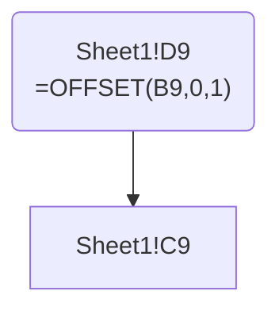

## 10. OFFSET/INDIRECT reference resolution with dynamic arguments

A much harder case is when the arguments of `OFFSET` or `INDIRECT`
involve computation and references to other cells. For example,
“Sheet1!E10” contains the formula `=OFFSET(C10,0,B10)`, which depends on
the value of “Sheet1!B10”. In this case, we must either:

1.  Treat “Sheet1!B10” as a constant that the user won’t modify, or
2.  Know the range of possible values that “Sheet1!B10” might resolve
    to, and/or
3.  Extract every cell in the workbook into our `DependencyGraph`,
    whether we detected it as a dependency of the targets or not, so
    that it’s available at runtime for `FormulaEvaluator` or generated
    Python code to resolve the dynamic reference.

### Option 1: use cached dynamic refs (currently implemented)

Option 1 is implemented by passing `use_cached_dynamic_refs=True` to
`create_dependency_graph`. This tells grapher to treat all dependencies
of the `OFFSET` function’s row/column arguments as constants, so that
the arguments can be resolved to scalar values by computing the formula
chain.

``` python
graph: DependencyGraph = create_dependency_graph(
    workbook_path, ["Sheet1!E10"], load_values=False, use_cached_dynamic_refs=True
)
```

    /home/user/excel-grapher/excel_grapher/grapher/parser.py:828: UserWarning: Resolved OFFSET/INDIRECT references from cached workbook values; these dependencies are fixed at graph-build time. Changing an input that shifts a resolution target outside the graph makes the graph uncomputable. Pass `dynamic_refs` to resolve over an input domain instead.
      _warn_cached_dynamic_once()

The risk with this approach is that the user may modify “Sheet1!B10”
after the graph is built, which will break the graph. For instance, if
the user changes “Sheet1!B10” from `0` (the default/cached value) to `1`
and then tries to evaluate “Sheet1!E10” using the `FormulaEvaluator`,
the graph will break because the dependency cell “Sheet1!D10” will not
be found in the extracted graph:

``` python
graph.set_node_value("Sheet1!B10", 1)
with FormulaEvaluator(graph) as evaluator:
    try:
        value = evaluator.evaluate("Sheet1!E10")
    except KeyError as e:
        print_text("KeyError: " + str(e))
```

``` text
KeyError: 'Cell Sheet1!D10 not found in graph'
```

### Option 2: use constraints to resolve dynamic refs (not yet fully implemented)

Option 2 is, in theory, another use case for constraints. The idea is
that if we know that input cells will be within particular number ranges
or will take one of a set of string values, we should be able to compute
all combinations of possible values and build a `DependencyGraph` that
covers all of them.

In practice, this gets very hard as the complexity of the formula chain
increases, because the number of possible combinations of values grows
exponentially and very quickly becomes computationally intractable.

However, I believe the combinatorial blowup problem can be solved in 95%
of cases with some combination of clever heuristics, logical solving,
and/or AI. For the other 5%, we can perhaps short-circuit the problem by
setting constraints directly on the dynamic ref cell rather than on the
input cells, and then accepting that an exception might be raised if the
constraint is not satisfied at runtime.

As in the “may cycle” example above, the expected user behavior would be
to declare constraints for the cells that inform the `row` and `column`
arguments of `OFFSET` or `INDIRECT` in a `dict[str, type]`, then pass a
`DynamicRefConfig` built with `DynamicRefConfig.from_constraints` to
`create_dependency_graph`. This tells grapher to use the constraints to
resolve the dynamic references.

Currently, this works for easy cases like the one in Row 10, but runs
into combinatorial explosion for more complex cases.

``` python
from typing import Literal

from excel_grapher import DynamicRefConfig

constraints_schema = {"Sheet1!B10": Literal[0, 1]}
config = DynamicRefConfig.from_constraints(constraints_schema, {})
graph: DependencyGraph = create_dependency_graph(
    workbook_path, ["Sheet1!E10"], load_values=False, dynamic_refs=config
)

print_mermaid(graph)
```

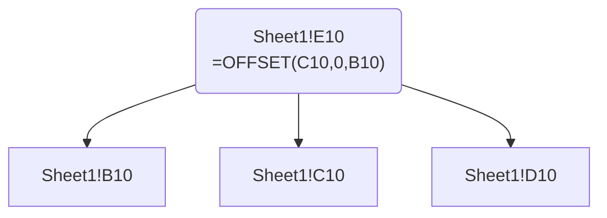

### Option 3: extract every cell in the workbook into our `DependencyGraph` (feasible but not implemented or currently planned)

Option 3 is safer than Option 1, but it’s not as surefire a solution as
it sounds:

1.  Suppose we extract every *populated* cell in the workbook into our
    `DependencyGraph`. That leaves *blank* cells out of the graph, and
    it might be the case that the user is intended to set a value for
    those blanks, and that a dynamic reference will resolve to one.
2.  Or suppose we extract *all* cells, whether populated or not. The
    graph quickly gets huge, especially if we don’t apply some
    commonsense boundaries on the sheet area to extract. Any given
    worksheet can have 16,384 columns and 1,048,576 rows, so the
    extracted cell/node count would be the product of those. But because
    of item 1 above, it’s hard to know what the bounds should be. This
    would have to be user-configurable, maybe with some sensible
    defaults.

We might also need to do some testing to make sure behaviors don’t
change in unexpected ways if we’re including cells in the
DependencyGraph that are not connected to the rest of the graph.

Until and unless we’ve ruled out Option 2, I don’t think the blowup of
graph size is worth the extra speed/safety we get from implementing
Option 3.

## 11. Multiple targets

Multiple targets can be passed to `create_dependency_graph`. In this
case, the graph will be a union of the graphs for each target. Note that
targets may be passed as sheet-qualified cells, ranges, or defined
names. In the example micro-workbook, we have defined the named range
“MyNamedRange” as the range “Sheet1!C11:D11”.

``` python
# Assert graph is identical whether we pass two cell addresses, a sheet-qualified range, or a defined name
assert (
    create_dependency_graph(workbook_path, ["Sheet1!C11", "Sheet1!D11"], load_values=True)
    == create_dependency_graph(workbook_path, ["Sheet1!C11:D11"], load_values=True)
    == create_dependency_graph(workbook_path, ["MyNamedRange"], load_values=True)
)

# Print the mermaid diagram for the graph
graph: DependencyGraph = create_dependency_graph(
    workbook_path, ["Sheet1!C11", "Sheet1!D11"], load_values=True
)
print_mermaid(graph)
```

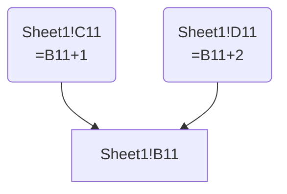
