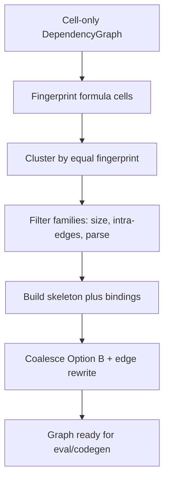

> **Superseded by [#523](https://github.com/teal-insights/excel-grapher/issues/523).**
> Multi-member / occupancy machinery is being removed from `DependencyGraph`
> (cell-only graph). This plan's Issue 1 storage and Issues 2–3 eval/codegen
> direction are obsolete; do not implement overlays or formula-group graph nodes
> from this document.

# Formula-group nodes — combined implementation plan

Three slices, in order. Each section is the full scope for that slice — do not
pull later work forward.

| Order | Slice | Tracking | Ships |
| ----- | ----- | -------- | ----- |
| 1 | Address model + storage | [#374](https://github.com/Teal-Insights/excel-grapher/issues/374) / retarget [PR #375](https://github.com/Teal-Insights/excel-grapher/pull/375) | `CellKey`/`RangeKey`/`UnionKey`, occupancy, mixed edges, `locate_cell` |
| 2 | Eval + codegen | [#377](https://github.com/Teal-Insights/excel-grapher/issues/377) | Skeleton, bindings, fingerprint, `specialize_group`, `ProjectedAddress`, evaluator, export |
| 3 | Detection + coalesce | (open new issue) | `coalesce_formula_groups`, fingerprint families, Option B rewrite, `formula_groups=` flag |

**Origin:** [PR #375](https://github.com/Teal-Insights/excel-grapher/pull/375) is the open PR for
[#374](https://github.com/Teal-Insights/excel-grapher/issues/374) (“row nodes”: `NodeKind.row`,
one-row extent keys, hand-built only). Review on that PR (Chris) rejected row-only
geometry as the long-term model: it cannot express non-adjacent cell sets, and
partial `min_row`/`max_row` fields imply column/table kinds that were never
finished. This plan **absorbs that review** and retargets #374/#375 toward
**formula-group (union) nodes**.

**Product model:** a graph node may own an arbitrary set of cells that share AST
*shape*; refs may differ freely. The node’s key is a canonical multi-area A1
string (union), not a synthetic `group:…` id and not one-row-only.


---

## Shared locked decisions (all issues)

- **Unique occupancy (Option B):** a workbook cell appears in the graph at most
  once — either as a `CellKey` node or as a member of exactly one
  `RangeKey`/`UnionKey` node — never both, never two multi-cell nodes.
- **Eval entrypoint:** `evaluate("Sheet1!E63")` (member / public cell address) →
  scalar. Evaluating a multi-area union key as a vector is out of scope.
- **Lookup story (from #375 review):** `get_node(key)` is exact-key only;
  collapsed member addresses use `locate_cell` (and, for export projection,
  `map_to_projected` → `ProjectedAddress`). Document this on `ProjectionResult`.
- **No special `NodeKind.row` long-term.** A one-row stripe is just a `RangeKey`
  whose `shape` is `ROW`. Migrate/remove `NodeKind.row` / `ParsedRowKey` /
  `make_row_node` as Issue 1 lands.
- **OptimalCompression / TACO:** skip non-cell keys (`shape != CELL`) until a
  later project teaches them about unions. Never inline/remove a union node as if
  it were a cell.
- **Builder:** Issues 1–2 leave `create_dependency_graph` cell-expanding. Issue 3
  opts into coalesce via an explicit flag.
- **Breaking data-model changes are allowed** (greenfield / no external users) —
  prefer the #375 counterproposal address model over additive row-only fields.

### What we take from PR #375 review (locked)

| #375 row-node PR | This plan |
| ---------------- | --------- |
| `NodeKind.row` + `Sheet1!D63:Y63` | `RangeKey` / `UnionKey` via `parse_node_key` |
| `min_col`…`max_row` on `Node` | Derived from parsed key; not the source of truth |
| `ParsedRowKey` | Drop; use `CellKey` \| `RangeKey` \| `UnionKey` |
| Cannot express non-adjacent cells | **Required** — `UnionKey` multi-area cover |
| No parameterization | Issue 2: `member_bindings` + `ProjectedAddress(parameters=…)` |
| `value` / `formula` on multi-cell node undecided | Issue 1: placeholders/`None`; Issue 2: skeleton + bindings; `value` stays `None` on multi-cell nodes |

---

# Issue 1 — Address model + storage + edges

**Tracking:** [#374](https://github.com/Teal-Insights/excel-grapher/issues/374); evolve or replace
[PR #375](https://github.com/Teal-Insights/excel-grapher/pull/375) rather than merging row-only as final.  
**Branch:** `issue-374-formula-group-nodes` (or retarget the #375 branch).  
**Goal:** Hand-built multi-cell nodes can be stored, keyed, edged, located, pickled
under the #375 address model.  
**Does not ship:** skeleton/bindings, evaluator, codegen, detection, builder groups,
full `ProjectedAddress` (Issue 2 — keep projection hooks compatible).

## Address model (from #375 sketch — locked)

Excel address strings expand to cells, ranges, and comma-separated unions.
`CellKey`, `RangeKey`, and `UnionKey` are `str` subclasses with derived geometry.
`parse_node_key` is the canonical entrypoint.

```python
class NodeShape(StrEnum):
    cell = "cell"
    row = "row"  # RangeKey with min_row == max_row
    column = "column"  # RangeKey with min_col == max_col
    range = "range"  # general rectangle
    union = "union"  # multi-area


class CellKey(str):
    @property
    def shape(self) -> NodeShape: ...
    @property
    def sheet(self) -> str: ...
    @property
    def column(self) -> str: ...
    @property
    def row(self) -> int: ...


class RangeKey(str):
    @property
    def shape(self) -> NodeShape: ...  # row | column | range
    @property
    def sheet(self) -> str: ...
    @property
    def min_col(self) -> str: ...
    @property
    def max_col(self) -> str: ...
    @property
    def min_row(self) -> int: ...
    @property
    def max_row(self) -> int: ...


type UnionMember = CellKey | RangeKey


class UnionKey(str):
    @property
    def shape(self) -> NodeShape: ...  # union
    @property
    def members(self) -> tuple[UnionMember, ...]: ...


type NodeKey = CellKey | RangeKey | UnionKey


def parse_node_key(value: str | NodeKey) -> NodeKey:
    """Canonicalize and return the appropriate key subtype."""
```

**Canonicalization (locked):**

- Safe constructors; normalize quoting / sheet syntax; strip `$`.
- Union members sorted deterministically; dedupe; **empty union → error**.
- **One-member union collapses** to that member (`CellKey` or `RangeKey`).
- Contiguous cell sets consolidate via the cover algorithm below into
  `RangeKey` or `UnionKey`.
- Graph keys are an **exact cover of owned cells**, not an Excel formula-operand
  rewriter (do not invent merges that change reference semantics).

## Invariants (enforced here)

1. **Arbitrary members** — a multi-cell node owns the cell set implied by its
   `RangeKey`/`UnionKey` (expand areas → cells). Non-contiguous and cross-sheet
   allowed.
2. **AST shape** — deferred to Issue 2; Issue 1 only stores identity + occupancy.
3. **Unique cell occupancy** — on `add_node` / `remove_node` / `locate_cell`.
4. **Key == cover** — `members_to_node_key(cells) -> CellKey | RangeKey | UnionKey`.

### Canonical cover algorithm (locked)

`members_to_node_key(members)` — pure, order-independent.

1. Normalize + dedupe cell keys; **empty → `ValueError`**.
2. Partition by sheet.
3. Per sheet: sort by `(row, col_index)`.
4. Greedy **horizontal runs** (consecutive columns on one row).
5. Greedy **vertical merge** of runs with identical `(min_col, max_col)`.
6. Format areas: 1×1 → `E4`; larger → `E4:I18`.
7. Emit:
   - One cell → `CellKey`.
   - One rectangle → `RangeKey` (`Sheet1!E4:I18`), including former row stripes.
   - Several areas → `UnionKey` e.g. `Sheet1!E4:I18,H23:K36,D9:H19,K11:P27,B16:E26`
     (one sheet: sheet qualifier once; cross-sheet: qualify each area; sort; no spaces).

Example: `{E5,A1,C1,B1,D1}` → `Sheet1!A1:D1,E5` (`UnionKey`).

MVP: building a “formula group” from a **single** cell collapses to `CellKey`
(prefer ordinary cell nodes). Cover build `O(n log n)`; occupancy lookup `O(1)`.

## Node data model (address-centric — locked)

Prefer Chris’s #375 counterproposal over `kind` + `min_*`/`max_*` as source of truth:

```python
@dataclass
class Node:
    address: NodeKey  # canonical CellKey | RangeKey | UnionKey
    formula: str | None
    normalized_formula: str | None
    value: Any  # None for multi-cell nodes in MVP
    is_leaf: bool
    is_target: bool = False
    metadata: dict[str, Any] = field(default_factory=dict)
    # Issue 2+: skeleton, shape_fingerprint, member_bindings, target_members

    @property
    def shape(self) -> NodeShape:
        return parse_node_key(self.address).shape

    @property
    def sheet(self) -> str | None: ...
    @property
    def column(self) -> str | None: ...
    @property
    def row(self) -> int | None: ...
```

Migration from #375 / current row APIs:

- Cell nodes: `address=CellKey(...)`; keep sheet/col/row construction helpers.
- Drop `NodeKind.row`, `ParsedRowKey`, extent fields as authoritative storage.
- Graph dict key == `str(address)`.

### Mutation rules

| Operation | Behavior |
| --------- | -------- |
| Empty member set / empty union | `ValueError` |
| Duplicate members in input | Dedupe |
| One-member union | Collapse to `CellKey`/`RangeKey` |
| `add_node` overlapping occupancy | `ValueError` |
| `remove_node(multi-cell key)` | Drop node + edges; clear occupancy for all expanded cells |
| `remove_node(member_cell)` while owned by multi-cell node | **Error** |

### Location API

- Occupancy index: cell → owning node key (`RangeKey`/`UnionKey`)
- `locate_cell(graph, cell_key) -> CellLocation | None`
- Document (#375): after collapse, call `locate_cell` before `get_node` for
  member addresses

### Formula / value on multi-cell nodes (answers #375 open question)

| Field | Multi-cell node (Issue 1) |
| ----- | ------------------------- |
| `formula` / `normalized_formula` | Optional placeholder / `None`; real template in Issue 2 |
| `value` | Always `None` — not a vector |

### Out of scope (Issue 1)

Detection, coalesce, skeleton/bindings/fingerprint, evaluator, codegen,
`formula_groups=` flag, full `ProjectedAddress` (Issue 2), JSON cache full
support (reject or serialize address — never silently drop), packing beyond
H-run + V-merge, OptimalCompression understanding of unions.

### Implementation sprints (TDD)

**Full sprint plan:** [formula-group-nodes-issue1-sprint.md](./formula-group-nodes-issue1-sprint.md)

1. **Keys** — `CellKey`/`RangeKey`/`UnionKey` + `parse_node_key` +
   `members_to_node_key`; include #375 row-key cases as `RangeKey(shape=row)`
2. **Node** — address-centric `Node`; migrate off `NodeKind.row` / extent fields
3. **Graph** — normalize via `parse_node_key`; occupancy; remove rules; mixed
   edges; pickle; projection copy; `locate_cell`
4. **Harden** — scenarios A–D; 1000-member locate smoke; cell-only regression;
   TACO/OptimalCompression skip `shape != cell`; docs for lookup story

### Files

`excel_grapher/core/address_keys.py` (or `grapher/node_key.py`),
`excel_grapher/grapher/node.py`, `excel_grapher/grapher/graph.py`,
`tests/unit/grapher/formula_groups/` (migrate `tests/unit/grapher/row_nodes/`),
TACO/compression guards as needed.

### Test checklist (Issue 1)

- [ ] `parse_node_key` round-trips cell / range / union; one-member union collapses
- [ ] Shuffled `{A1,B1,C1,D1,E5}` → `Sheet1!A1:D1,E5`; filled block → single `RangeKey`
- [ ] Former row case `Sheet1!D63:Y63` → `RangeKey` with `shape=row`
- [ ] Quoted sheet + cross-sheet unions; `$` / corners / spaces normalize
- [ ] Empty → error; duplicates dedupe
- [ ] Occupancy on add; `remove_node(union)` clears; `remove_node(member)` errors
- [ ] Mixed edges; `locate_cell` vs `get_node` documented behavior
- [ ] Pickle + `_copy_for_projection` preserve multi-cell nodes
- [ ] **A:** outside formula → union precedent; eval order / dependents
- [ ] **B:** cross-sheet members locate to same union
- [ ] **C:** `create_dependency_graph` still cell-expands (no unions emitted)
- [ ] **D:** TACO + OptimalCompression skip/do not crash on hand-built union
- [ ] 1000-member `locate_cell` within budget / O(1) occupancy
- [ ] Cell-only graphs unchanged; #375 row-node APIs removed or shimmed

### Success criteria (Issue 1)

- [ ] Cell-only behavior unchanged when no multi-cell nodes present
- [ ] #375 address model (`CellKey`/`RangeKey`/`UnionKey`) is the key source of truth
- [ ] Non-adjacent members supported; row-only `NodeKind` not required
- [ ] Occupancy + remove rules enforced; pickle/projection preserve mixed graphs
- [ ] Lookup story documented (`locate_cell` before `get_node` for members)
- [ ] No eval/codegen/detection required to merge

---

# Issue 2 — Evaluator + codegen

**Depends on:** Issue 1 merged (or stacked).  
**Branch:** `issue-377-formula-groups-eval-codegen`  
**Goal:** Hand-built Option B groups evaluate and export with evaluator↔export
parity (lazy per member).  
**Does not ship:** detection, coalesce, builder `formula_groups=`.


## Projection parameterization (from #375 review — locked for Issue 2)

Extend export projection so collapsed public cell addresses map to the owning
multi-cell node **plus** per-member parameters (bindings), not a bare forward:

```python
@dataclass(frozen=True)
class ProjectedAddress:
    address: NodeKey  # owning RangeKey / UnionKey
    parameters: Mapping[str, Any] | None = None  # e.g. member bindings / refs
```

- `ProjectionManifest.map_to_projected(cell) -> ProjectedAddress`
- Codegen consumes `parameters` for `_group_*` / wrapper call sites
- Keep a `ProjectedNode` (or fields only on projected graphs) if
  `rewritten_formula` / `values` must stay off the base `Node` — optional; MVP
  can keep skeleton on the canonical multi-cell `Node` and use
  `ProjectedAddress` only for the map API


## Adds to the group `Node`

```python
shape_fingerprint: str | bytes
skeleton: AstNode  # holes or baked address leaves
member_bindings: Mapping[NodeKey, tuple[AddressLeaf, ...]]
```

Issue 2 **enforces** shared AST shape + binding arity when attaching template
fields. Occupancy stays as Issue 1.

## Invariants (additional)

- Same shape: tree, ops, function names/arity, literals fixed.
- Address leaves free (`CellRef` / `Range` / `WholeColumn` / `WholeRow`) but
  **same leaf kind** at each hole.
- Every member’s bindings length == hole count; kinds align.

## Entrypoint (Option B)

```text
evaluate("Sheet1!E63")
  → locate_cell → shape != cell (RangeKey/UnionKey)
  → specialize_group(skeleton, member_bindings[member])
  → eval → cache under member key → scalar
```

- Multi-area group key eval → clear error (MVP).
- Codegen: one `_group_*` helper + per-member wrappers in `_RESOLVED_FORMULAS`
  (wrappers are not graph nodes). Bindings as helper args or closed-over constants.
- Laziness: one member must not eagerly evaluate siblings.

## Shape + specialize

**Fingerprint:** walk AST; address leaves → typed holes (`CELL`/`RANGE`/…);
everything else concrete. Equal fingerprints ⇒ group-compatible.

**`specialize_group(skeleton, bindings) -> AstNode`:** fill holes in walk order;
kind/arity mismatch → error. No column-letter rewrite.

Hand-built fixtures set skeleton + bindings explicitly. Issue 3 will discover
them by aligning member walks (bake identical leaves).

### Example

```text
D63: =INDEX($D40:$AJ50, MATCH(1,$AJ40:$AJ50,0), MATCH(D$35,$D$35:$Y$35,0))
B10: =INDEX($D40:$AJ50, MATCH(1,$AJ40:$AJ50,0), MATCH(Sheet2!Z9,$D$35:$Y$35,0))
```

Identical ranges may be baked; the differing `CELL` is a hole with per-member
bindings (`D$35` vs `Sheet2!Z9`).

## Out of scope (Issue 2)

Detection/coalesce/builder flag; member alias nodes; group-key vector eval;
varying literals/ops; mixing leaf kinds at one hole; OptimalCompression feature
work beyond not crashing.

## Implementation sprints (TDD)

1. Fingerprint + `specialize_group` (`excel_grapher/grapher/formula_groups.py`)
2. Template fields on `Node` + Option B fixtures (incl. non-contiguous/cross-sheet)
   + cell-only twin
3. Evaluator `locate_cell` group path; reject group-key eval; lazy cache
4. Codegen `_group_*` + wrappers
5. Parity / errors / cell-only regression

Sprints 3–4 may overlap after fixtures exist; keep specialize shared.

## Files

`excel_grapher/grapher/formula_groups.py`, `node.py`,
`excel_grapher/evaluator/evaluator.py`, `excel_grapher/exporter/codegen.py`,
`tests/fixtures/formula_groups/`, unit + parity tests.

## Test checklist (Issue 2)

- [ ] Fingerprint ignores addresses; distinguishes literals/ops
- [ ] Specialize fills holes; rejects kind/arity mismatch
- [ ] Option B fixture: no member cell nodes; non-contiguous/cross-sheet eval
- [ ] `evaluate(member)` matches twin; siblings not cached; group key rejected
- [ ] One `_group_*` helper; wrappers pass correct bindings
- [ ] Codegen ↔ evaluator parity (values + error codes)
- [ ] Cell-only graphs/codegen unchanged

## Success criteria (Issue 2)

- [ ] Member eval equals twin; lazy; non-contiguous/cross-sheet work
- [ ] Export matches evaluator; unique occupancy in fixtures
- [ ] No detection required; no row/column specialize API

---

# Issue 3 — Detection + coalesce

**Depends on:** Issues 1–2 merged (fingerprint, `specialize_group`, Option B
eval/codegen already work on hand-built groups).  
**Branch:** `issue-formula-groups-detection` (open a new GitHub issue; do not
overload #374/#377).  
**Goal:** Opt-in batch pass that finds same-shape formula families on a
**cell-only** graph and rewrites them into Issue 2–compatible Option B group
nodes — so evaluator and codegen need no second entrypoint model.  
**Does not ship:** vector eval of multi-area keys; fuzzy/near-miss matching;
OptimalCompression/TACO features for groups beyond `shape != cell` guards;
incremental coalesce under live edits.



## Public API (locked)

Prefer a **post-pass** so the builder stays understandable and tests can run
detection on hand-built cell graphs without a workbook:

```python
def coalesce_formula_groups(
    graph: DependencyGraph,
    *,
    min_family_size: int = 2,
) -> CoalesceReport:
    """In-place: replace same-shape cell families with Option B group nodes.

    No-op families are left as cells. Mutates `graph`. Returns a report of
    created group keys, skipped families, and reasons.
    """
```

Builder wiring (default **off**):

```python
create_dependency_graph(
    ...,
    formula_groups: bool = False,  # when True, call coalesce_formula_groups at end
)
```

CLI (if a graph-build command exists): mirror the flag; otherwise document the
Python API only in this issue.

`CoalesceReport` (sketch):

```python
@dataclass(frozen=True)
class CoalesceReport:
    created_groups: tuple[NodeKey, ...]  # multi-area keys
    skipped_families: tuple[SkippedFamily, ...]  # fingerprint + reason


@dataclass(frozen=True)
class SkippedFamily:
    fingerprint: str
    members: tuple[NodeKey, ...]
    reason: Literal[
        "below_min_size",
        "intra_family_edge",
        "unparseable_formula",
        "kind_mismatch",  # defensive; fingerprint should prevent
    ]
```

## Algorithm (normative)

### Step 1 — Candidates

Scan `graph` nodes where:

- `shape == cell (CellKey)`
- `normalized_formula` is non-`None` / non-empty
- not a leaf (has a formula body)

Skip already-`shape != cell (RangeKey/UnionKey)` nodes (idempotent second pass is a no-op on groups).

### Step 2 — Fingerprint + cluster

For each candidate, parse `normalized_formula` → AST; compute Issue 2
`shape_fingerprint`. Unparseable → that cell stays a cell (optionally record
skip if it would have been in a family — usually just omit from clusters).

Bucket: `dict[fingerprint, list[NodeKey]]`.

### Step 3 — Family filters (locked)

For each bucket with members `M`:

| Rule | Action |
| ---- | ------ |
| `len(M) < min_family_size` (default 2) | Skip (`below_min_size`) |
| Any edge `a → b` with `a ∈ M` and `b ∈ M` (intra-family) | **Skip whole family** (`intra_family_edge`) — leave all as cells |
| After building skeleton, hole kind ≠ binding kind for any member | Skip (`kind_mismatch`) — defensive |

**Why skip intra-family edges:** coalescing would create `G → G` self-deps or
lose which member another member read. MVP does not model per-member precedent
rewrites inside a family. Cross-family and cell↔group edges are fine.

Cross-sheet members in one fingerprint bucket **are allowed**.

Process families in deterministic order (sort fingerprints lexicographically;
within a family sort member keys workbook-order) so reports and group keys are
stable.

### Step 4 — Skeleton + bindings from the family

For members `M = (m1, …, mk)` in sorted workbook order:

1. Parse each member’s `normalized_formula` to AST; walk address-bearing leaves
   in the **same order** as Issue 2 fingerprint / `specialize_group`.
2. Let `L` = leaf count (identical across `M` by fingerprint).
3. For each index `i in 0..L-1`:
   - Collect the concrete leaves `leaf[m][i]` for all `m ∈ M`.
   - If **all equal** (AST equality of the address leaf): **bake** into skeleton.
   - Else: skeleton hole of that leaf’s kind;  
     `member_bindings[m][slot] = leaf[m][i]` for each `m`.
4. Non-address nodes copied from any member (all match by fingerprint).
5. Set `shape_fingerprint` on the group to the cluster fingerprint.

Anchor for optional debug `normalized_formula` string: specialize skeleton with
`m1`’s bindings (first member in workbook order) — not required for eval if
`skeleton` AST is authoritative.

### Step 5 — Build group node

```text
G = make_union_node(
      members=M,
      skeleton=...,
      member_bindings=...,
      shape_fingerprint=...,
      # see field merge below
    )
key(G) = members_to_node_key(M)   # Issue 1 algorithm
```

**Field merge (locked):**

| Field | Rule |
| ----- | ---- |
| `members` | Sorted unique cell keys `M` |
| `formula` / `normalized_formula` | Optional: specialized string for first member, or `None` if AST-only |
| `value` | `None` on the group (values live at eval cache under member keys) |
| `is_leaf` | `False` if group has any deps after rewrite; else True |
| `is_target` | `True` if **any** member had `is_target` |
| `target_members` | New optional field or `metadata["target_members"]`: tuple of member keys that were targets — so public target enumeration can still list member addresses |
| `metadata` | Shallow-merge member metadata only if keys do not conflict; else keep empty / first wins — document choice; MVP: **drop** per-cell metadata onto the group (avoid silent loss of distinct keys) unless a single member; prefer preserving `target_members` explicitly |

**`target_keys()` (Issue 3 change):** return workbook-ordered keys that are either
`CellKey` nodes with `is_target`, or **member addresses** listed in each group’s
`target_members` (not the multi-area group key). Codegen/export keep calling
member addresses. OptimalCompression `preserve` default continues to see those
member strings — but members are not nodes; compression already must skip
groups — document that preserve keys may be member addresses resolved via
`locate_cell` only when compression is taught that later; for Issue 3,
compression still only collapses `CellKey` nodes.

### Step 6 — Edge rewrite then remove members

Let `M` be member keys, `G` the new group key. Snapshot all incident edges
**before** removing nodes.

**Inbound** (dependent → member): for each edge `d → m` with `m ∈ M`, `d ∉ M`
(intra already filtered):

- `add_edge(d, G, guard=…, provenance=…)` using existing merge rules when
  multiple members were precedents of the same `d`:
  - **Guards:** same as `DependencyGraph.add_edge` today — if conflicting
    non-equal guards, `or_guard`; if either side unguarded, result unguarded.
  - **Provenance:** `merge_edge_provenance` of the contributing `d → m` edges.
  - **Caveat:** direct-site spans point at **member** address substrings in
    `d`’s formula. After rewrite, the edge is `d → G` but the formula text still
    names the member cell (correct for Excel semantics / Issue 2 eval via
    `locate_cell`). Do **not** rewrite dependent formulas in Issue 3.
  - Provenance sites may therefore not contain the group key string —
    OptimalCompression must not assume it can stringify-replace `G` into
    dependents. Already out of scope beyond not crashing.

**Outbound** (member → dep): for each edge `m → dep` with `m ∈ M`, `dep ∉ M`:

- `add_edge(G, dep, guard=…, provenance=…)` union via the same merge helpers.
- If several members depended on the same `dep`, merge guards/provenance.

**Self / intra:** already excluded by filter.

Then:

1. `add_node(G)` (occupancy: all of `M` become owned by `G` — must not already
   exist as cells elsewhere; on a fresh cell-only graph the cells *are* `M`, so
   remove members **after** or carefully: **remove each `m ∈ M` first** (which
   drops their edges — hence snapshot first), then `add_node(G)`, then re-add
   snapshot edges rewritten to `G`. Recommended transaction order:

   ```text
   snapshot edges + node fields for M
   for m in M: remove_node(m)      # clears old occupancy
   add_node(G)                     # sets occupancy for all members
   re-add rewritten edges
   ```

2. Verify `locate_cell(m)` → group for every `m ∈ M`; no `CellKey` node for `m`.

### Step 7 — Idempotency

Running `coalesce_formula_groups` again: candidates are only `CellKey` nodes, so
existing groups are left alone. No further merges of groups with cells of the
same fingerprint in MVP (do not absorb stragglers into an existing group).

## Worked example

Cell-only graph:

```text
Sheet1!D63 = INDEX($D40:$AJ50, MATCH(1,$AJ40:$AJ50,0), MATCH(D$35,$D$35:$Y$35,0))
Sheet1!B10 = INDEX($D40:$AJ50, MATCH(1,$AJ40:$AJ50,0), MATCH(Sheet2!Z9,$D$35:$Y$35,0))
# both depend on the same static ranges; Outside!A1 depends on D63
```

After coalesce:

```text
Group key: Sheet1!B10,D63          # Issue 1 cover (sorted)
members: (Sheet1!B10, Sheet1!D63)
skeleton: INDEX(baked ranges..., MATCH(1, baked, 0), MATCH(<CELL>, baked, 0))
bindings:
  Sheet1!D63 → (D$35,)
  Sheet1!B10 → (Sheet2!Z9,)
edges: Outside!A1 → group; group → (shared range deps)
# no cell nodes B10 / D63
```

`evaluate("Sheet1!D63")` and codegen wrappers behave as in Issue 2.

## Out of scope (Issue 3)

- Enabling groups by default in `create_dependency_graph`
- Merging a cell into an **existing** group on a second pass
- Rewriting dependent formula text to mention the group key
- Coalescing families with intra-family edges (skipped, not partially merged)
- Fuzzy fingerprints / literal-tolerant matching
- Teaching OptimalCompression to inline through groups
- Vector / multi-area `evaluate(group_key)`
- Parallel or incremental / watch-mode coalesce

## Implementation sprints (TDD)

Practice RED → GREEN → refactor. Keep pure detection separate from graph mutate.

### Sprint 1 — Discover + skeleton (no graph mutation)

**Files:** `excel_grapher/grapher/formula_groups.py` (or `formula_groups/detect.py`)

| Task | Done when |
| ---- | --------- |
| `iter_formula_families(graph) -> …` | Buckets by fingerprint; skips unparseable |
| Intra-family edge detection | Family with `a→b` both in M marked skip |
| `build_group_template(members, formulas) -> skeleton, bindings, fp` | Bake vs hole per aligned walk |
| Unit tests | Same-shape cluster; different literal → different fp; bake/hole matrix; intra-edge skip reason |

### Sprint 2 — Coalesce transform

**Files:** `excel_grapher/grapher/formula_groups.py`, maybe thin helpers on `DependencyGraph`

| Task | Done when |
| ---- | --------- |
| `coalesce_formula_groups(graph)` | Snapshot → remove members → add group → rewrite edges |
| Guard/provenance merge | Uses existing `add_edge` / `merge_edge_provenance` / `or_guard` |
| Occupancy | `locate_cell` for each former member; overlap errors impossible if order correct |
| `target_members` + `target_keys()` | Former target members still listed as member addresses |
| `CoalesceReport` | Created + skipped with reasons |
| Unit tests | Twin cell graph → Option B; inbound/outbound edge merge; targets preserved; second pass idempotent |

### Sprint 3 — Builder wiring + fixtures

**Files:** `excel_grapher/grapher/builder.py`, tests/fixtures, user_guide blurb

| Task | Done when |
| ---- | --------- |
| `formula_groups: bool = False` | When True, run coalesce at end of build |
| Default off | Existing builder tests unchanged |
| Fixture workbook / micro graph | Non-contiguous + cross-sheet same-shape pair |
| Docs | Short note in user guide: opt-in flag + Option B semantics |

### Sprint 4 — Parity + harden

| Task | Done when |
| ---- | --------- |
| Eval parity | Detected group `evaluate(member)` matches pre-coalesce cell graph |
| Codegen parity | `assert_codegen_matches_evaluator` on coalesced graph |
| Intra-family skip | Family with member→member edge remains cells; report reason |
| Min size | Lone formula cell never becomes a 1-member group |
| Cell-only regression | `formula_groups=False` path identical to pre-Issue-3 |
| TACO / OptimalCompression | Hand-coalesced graph: skip/`shape != cell`, no crash |

## Files likely touched

| Area | Path |
| ---- | ---- |
| Detect / coalesce | `excel_grapher/grapher/formula_groups.py` (extend Issue 2 module) |
| Builder | `excel_grapher/grapher/builder.py` |
| Targets | `excel_grapher/grapher/graph.py` (`target_keys` expansion) |
| Node (optional) | `excel_grapher/grapher/node.py` — `target_members` field or metadata convention |
| Tests | `tests/unit/grapher/formula_groups/test_detect.py`, `test_coalesce.py`; integration parity |
| Docs | `user_guide/01-dependency-graphs.qmd` (short opt-in note) |

## Test checklist (Issue 3)

**Discovery**

- [ ] Two identical-shape formulas cluster; `A1+1` vs `A1+2` do not
- [ ] Cross-sheet / non-contiguous cells in one family
- [ ] Aligned walk: shared refs baked; differing refs → holes + bindings
- [ ] Intra-family edge → skip whole family + report `intra_family_edge`
- [ ] `len < 2` → `below_min_size`
- [ ] Unparseable formula omitted from clusters

**Coalesce**

- [ ] After pass: no member `CellKey` nodes; `locate_cell` → group
- [ ] Group key == `members_to_node_key(M)`
- [ ] Inbound edges merged onto group (guards/provenance via existing merge)
- [ ] Outbound deps = union of member deps
- [ ] Dependent formulas **unchanged** (still name member addresses)
- [ ] `target_keys()` lists former target **member** addresses
- [ ] Second `coalesce_formula_groups` is idempotent (no duplicate groups)
- [ ] Evaluation order on coalesced graph does not crash / includes group node

**Wiring + parity**

- [ ] `create_dependency_graph(..., formula_groups=False)` unchanged
- [ ] `formula_groups=True` produces Option B groups on fixture
- [ ] `evaluate(member)` equals pre-coalesce cell-only twin
- [ ] Codegen ↔ evaluator parity on coalesced graph
- [ ] OptimalCompression/TACO do not crash on coalesced graph

## Success criteria (Issue 3)

- [ ] Opt-in detection emits Issue 2–compatible Option B groups
- [ ] Default builder path remains cell-only
- [ ] Intra-family families are skipped safely (no `G→G` footgun)
- [ ] Targets remain addressable as member keys via `target_keys()`
- [ ] No new eval entrypoint; no row-geometry or fuzzy matching

---

## Cross-cutting notes

- **PR #375:** do not merge row-only as the final #374 design; retarget to this address model.

- **Pickle (Issue 1+):** preserve `address` / key shape; Issue 2 fields ride along on
  `Node`. Bump pickle version only if required by existing serialization rules.
- **JSON cache:** do not silently drop group fields; reject or fully serialize.
- **Naming:** prefer `formula_groups` in new APIs; retire `row_nodes` demos/tests
  as Issues 1–2 land.
