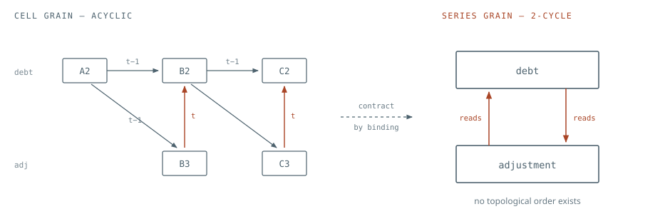
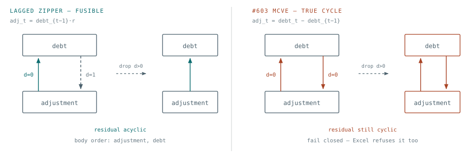

# Scheduling the inverted tree

A bound series is not a node in a graph. It is a **statement** plus an
**iteration domain**, and the thing that has to be acyclic is the schedule over
**instances**, not the graph over statements. Once that swap is made, the
period-lag zipper stops being a special case and the fail-closed rule
generalizes past integer years.

Findings 1 and 2 below were reproduced by running code on this branch at the
pinned commit.

## 1. Before the theory — two things the branch needs to know first

### Finding 1 — the #603 repro is genuinely circular

[#603](https://github.com/Teal-Insights/excel-grapher/issues/603) states the
shape as `debt_t = debt_{t-1} + adj_t` with `adj_t = debt_t - debt_{t-1}`.
Substituting gives `debt_t = debt_t`. In the workbook that is `B2 = A2+B3`
against `B3 = B2-A2` — a circular reference at cell grain, which Excel flags and
refuses to evaluate. Running the MCVE's own graph through
`networkx.simple_cycles` confirms it:

```text
issue-603 MCVE cell cycles: [['Engine!C2', 'Engine!C3'], ['Engine!B2', 'Engine!B3']]
corrected zipper cell cycles: []
```

So `InvertedTreeExportError` is the **right outcome** for that input; only the
message is wrong, because it blames series granularity for a cycle that is real
at cell granularity.

> **If a fix makes that MCVE emit code, the emitted code computes a circular
> reference and silently diverges from Excel.**

The zipper has to be re-cut so at least one edge carries a lag:

```python
# cell-acyclic, still fails identically at _topo_sort — a valid #603 repro
sheet["A2"] = "=100"
sheet["B2"] = "=A2+B3"  # debt_t = debt_{t-1} + adj_t
sheet["C2"] = "=B2+C3"
sheet["B3"] = "=A2*0.02"  # adj_t = debt_{t-1} * r  <- lag breaks the cell cycle
sheet["C3"] = "=B2*0.02"
```

That workbook has no cell cycle and still raises `cyclic formula-series
dependencies among ['adjustment', 'debt']`. It is the repro the fix should be
tested against, and it is the acceptance test that tells a correct fix apart
from one that has merely disabled the check.

### Finding 2 — unverified shape uniformity, silent wrong answers

`emit_helper_body` reads the AST of `series.cells[0]` and emits it for every `i`
in the loop. `collect_series_deps` visits every cell, so it catches illegal
*references*, but two members with legal-but-different formulas both pass. A
three-cell series where each member has its own formula compiles clean and
returns the wrong numbers:

```text
Engine!A2:C2 bound as one `layout: series`
A2 = "=1"   B2 = "=A2*2"   C2 = "=B2+100"      Excel: 1, 2, 102
```

```python
# emitted internals.py
def path() -> tuple[float | str, ...]:
    n = 3
    prior: float | str = 0
    for i in range(n):
        prior = as_measure(1)  # <- cells[0]'s formula, for every member
        path.append(prior)
    return tuple(path)  # returns (1.0, 1.0, 1.0)
```

This matters to the redesign beyond the bug: **uniform formula shape is the
property that makes the whole paradigm compress**, and it is currently a user
obligation enforced by nothing. It should be a machine-checked partition, using
the `FormulaShapeTable` interning that already exists in
`excel_grapher/core/formula_shape.py`.

## 2. Diagnosis — contraction does not preserve acyclicity

| Term | Meaning |
| ---- | ------- |
| **statement** | The thing you write code for *once* — one formula shape. A bound series contributes one statement, which is why function count stays at Θ(series). |
| **instance** | One execution of a statement at one index point — that is, one workbook cell. `debt` is a statement; `debt@2011` is an instance. |
| **the gap** | Excel's dependency graph is a graph over **instances**. Bindings hand you **statements**. Every symptom in #603 is that gap: a cycle over statements that does not exist over instances. |

Binding a range of cells to a series id and treating that id as one node is a
graph *quotient*: partition the vertices, contract each block to a point, keep
an edge between blocks whenever any edge crosses between them. Quotients of DAGs
are not DAGs. Two edges pointing opposite ways between the same pair of blocks
become a 2-cycle no matter how carefully the underlying cells are ordered.

That is the entire content of #603, and it is not a defect in the implementation
— it is a property of the representation. `_topo_sort` is asking a question that
has no answer at that grain.



*The quotient invents the cycle.* Five cells, six edges, no cycle: each vertical
edge is same-period (`t`), each other edge crosses a period boundary (`t-1`).
Contract the two rows into their bound series and the period information — the
only thing distinguishing the two directions — is discarded, leaving a 2-cycle.
The fix is not to find a cleverer contraction; it is to stop discarding the
index.

### The two moves available, and why only one is affordable

- **Refine the partition** until the quotient is acyclic. This always terminates
  — one block per cell is acyclic by assumption — but it costs code size, and in
  the limit costs Θ(cells). It is what
  [#602](https://github.com/Teal-Insights/excel-grapher/issues/602)'s workaround
  asks users to do by hand ("split each measure into its own series"), and taken
  literally it produces a function per year rather than per indicator.
- **Keep the partition and schedule instances instead of statements.** Fuse the
  cyclic block into one loop whose iteration order discharges the offending
  edges. Code size is unchanged; the cost is analysis. This is the move that
  preserves the paradigm's reason for existing.

Refinement and fusion sit on the same lattice, and the design goal states
cleanly in those terms: *find the coarsest partition refinement that is either
acyclic or fusible.*

### Two things called "partition", with opposite costs

There is a middle path worth naming, because it is the one most people arrive
at: refine the statements finely, then *re-merge* by emitting one function per
original series with conditional routing inside that selects the right piece.
That keeps function count at Θ(series) and dodges the per-year absurdity. It
works — but the fine partition still bounds how big the routing gets, because
you computed it and now have to encode it.

- **Partitioning statements** — splitting `debt` into `debt_2009`, `debt_2010`,
  … Atomization. Re-merging hides it; it does not shrink it.
- **Partitioning the index domain** — one statement, one function, regions
  *inside* it where the guard or the formula differs. This is the only partition
  fusion ever needs, and it is bounded by the number of genuinely distinct
  regions, which is usually two.

Fusion reaches the same generated code without computing the fine partition at
all. The cycle is broken by loop order plus statement order inside the body — no
split. Routing then appears for two narrow reasons only, and section 6 shows
exactly what it costs.

## 3. Representation — what an edge has to carry

Today a dependency is recorded as membership in one of four sets on
`SeriesDeps` — `aligned_ids`, `lookup_ids`, `lagged_ids`, `index_maps` — plus
the booleans `is_scan` and `seed_id`. Those are six partial encodings of one
thing: an **access function** mapping a consumer instance to the producer
instance it reads.

| Access class | Form | Distance | Today | Schedulable? |
| ------------ | ---- | -------- | ----- | ------------ |
| `identity` | `f(i) = i` | 0 | `aligned_ids` | Yes — same loop iteration, orders the body |
| `shift` | `f(i) = i - k` | k | `lagged_ids`, `is_scan` | Yes — discharged by loop order when `k > 0` |
| `affine` | `f(i) = a*i + b` | varies | — | Yes, if monotone in the schedule dimension |
| `gather` | static `f`, irregular | per instance | `index_maps` | Yes, if every distance is `>= 0` |
| `whole` | consumer reads all of producer | — | `lookup_ids` | Only across SCCs, never inside a fused loop |
| `dynamic` | `f` depends on values | unknown | collapses to `lookup_ids` | No — must fall through to demand-driven |

### Where the index comes from when the keys are not years

The generalization worry — "this must work for Excel workbooks in general, not
just integer year series" — resolves once you notice that the schedule never
needs the *semantics* of the key. It needs a total order the dependences
respect. Two sources are always available, and they serve different jobs:

- **Layout position** — the expansion order of the `data_range`, already
  computed by `expand_data_range`. Always exists, needs no key semantics at all,
  and is the right default order for the schedule dimension.
- **The bindings key** — `key: [TIME_PERIOD]` with resolved values per cell.
  Needed only for *alignment* between two series whose index sets differ, where
  the correspondence is a join on key values rather than a positional offset.

The second is currently thrown away: `build_catalog` reads `entry["key"]` for
field *names* and never resolves per-cell key *values*, even though
`resolve_series_binding` already produces a `key` dict on every
`LeafResolution`. Alignment is instead re-derived by scanning ASTs and recording
which positions each host cell happened to touch.

> **Design point.** Give each statement an explicit **index domain**: an ordered
> tuple of key points, one per member. Alignment between two statements becomes
> a map between domains, computed once, rather than an emergent property of AST
> traversal. This is also what makes #602 tractable — a 2-D row is a statement
> whose domain is a tuple `(TIME_PERIOD, MEASURE)`, and "sibling reference" is
> just an access function with a nonzero component on the second axis.

## 4. The rule — one legality test replaces the topological sort

1. **Condense.** Tarjan the statement graph. The condensation of any directed
   graph is a DAG, so ordering the SCCs *always succeeds*. This step can never
   raise — already an improvement, since `_topo_sort` currently raises on the
   whole remaining set and names statements that are merely downstream of the
   problem.
2. **Discharge.** Inside each nontrivial SCC, delete every edge whose distance
   vector is lexicographically positive under the chosen loop order. Those edges
   read values the loop has already written; sequential iteration satisfies them
   for free.
3. **Order or refuse.** The residual — the distance-zero subgraph — must be
   acyclic. Topologically sort it: that order is the statement order *inside the
   loop body*. If the residual has a cycle, two statements need each other at
   the same index point, which is a real circular reference. **Fail closed
   there, and only there.**



*Same SCC, opposite verdicts, decided by one number per edge.* Both workbooks
produce the identical two-node cycle at series grain, which is why `_topo_sort`
cannot tell them apart. Annotating each edge with its dependence distance
separates them: dropping the `d=1` edge leaves an orderable residual on the
left, and nothing to drop on the right. The right-hand case is #603's own MCVE.

This test is not novel — it is Allen & Kennedy's codegen algorithm for
vectorizing loops, and it is also, exactly, the causality analysis of
synchronous dataflow languages. **Lustre is the closest analogy this project
has:** a bound series is a stream, `t-1` is `pre`, a fused SCC compiles to a
`step()` function, and Lustre's legality rule is stated as "every cycle must
pass through at least one `pre`" — which is step 3 above, word for word. That is
also the honest answer to "how do we generalize past integer years": Lustre
never had integer years. It had clocks.

## 5. A trap in the current plan — domains, not lengths

Restoring member-level evaluation inside one year loop driven by
`require_aligned` will be wrong inside a fused SCC, and the valid #603 repro
above already breaks it: `debt` has three members (`A2:C2`), `adjustment` has
two (`B3:C3`). They are genuinely misaligned — the adjustment row simply does
not exist in the first period — and `require_aligned` raises on exactly that.

Series in one SCC will routinely have different domains: a seed period with no
adjustment, a terminal period with no forward-looking row, measures that start
late. The fused loop must therefore iterate the **union** of member domains and
guard each statement by its own domain predicate:

```python
# wrong inside a fused SCC
n = require_aligned(debt, adjustment)  # raises: 3 vs 2

# right: one index space, per-statement domains
for t in schedule:  # union of member domains, in schedule order
    if t in adjustment_domain:  # guard, not an alignment assertion
        adjustment[t] = ...
    if t in debt_domain:
        debt[t] = ...
```

In Lustre these guards are clocks; in polyhedral terms they are the statement's
iteration domain. `require_aligned` keeps its job at the *orchestrator*
boundary, where it validates caller-supplied input arrays against the catalog.
It should not survive into a fused loop.

## 6. Emission — what survives into the generated code

A schedule is a compile-time artifact. It does not need to be retained in the
emitted package as a table, a dispatch map, or an order constant — it
materializes as **program order** and is then discarded by the generator. This
is the general property in both Allen–Kennedy and Lustre, not a lucky case: the
loop's direction encodes the schedule between index points, and the textual
sequence of statements inside the body encodes it within one index point.

Here is the whole of section 4 applied to the corrected #603 repro. Index by
period `t`; `adjustment@t = debt@(t-1)*r` is distance 1, and
`debt@t = debt@(t-1) + adjustment@t` is distance 0 from adjustment plus a
distance-1 self-edge. Dropping the distance-1 edges leaves the single residual
edge `adjustment -> debt`, so that is the body order:

```python
def debt_engine(initial_debt: float, r: float):
    debt: list[float | str] = []
    adjustment: list[float | str] = []
    for t in range(3):  # schedule -> loop direction
        if t == 0:  # peeled prologue: adjustment's domain starts at t=1
            debt.append(initial_debt)
            continue
        adjustment.append(debt[t - 1] * r)  # residual order -> statement order
        debt.append(debt[t - 1] + adjustment[t - 1])
    return tuple(debt), tuple(adjustment)
```

One function, one loop, one guard, two statements — and no per-year anything.
Note what is *absent*: no order table, no region map, no schedule. Note also
that the two series have different domains (three periods against two), which is
why the fused body addresses `adjustment` at a compile-time offset rather than
asserting a shared length.

### What bounds the routing

The branch count is set by the number of distinct regions along the schedule
where the *statement set or access class* changes — never by the number of index
points. Three consequences:

- **Peel boundaries.** A seed period, a terminal period, a row that starts late:
  each is a peeled iteration, not a table entry. That is the common case and it
  costs one branch.
- **Regime changes stay in the expression.** A workbook `IF` that switches
  behaviour at a shock year is already a conditional inside the formula. It
  never becomes routing.
- **Do not chase minimality.** Splitting an index domain into the fewest regions
  is an optimization problem in general. Greedy peel-then-merge reaches the
  two-branch answer on everything regular, and the irregular residue degrades to
  a membership predicate — the worst case that was acceptable anyway.

The one way a schedule leaks back into the output as data is the literal index
tuples of section 8 — `take(x, (0, 1, 2, ...))`. That is precisely the construct
to replace with symbolic index sets, and doing so is what keeps the promise that
nothing cell-sized appears in the emitted source.

## 7. Proposal — a four-rung ladder with a total fallback

Rather than one scheduling strategy that must cover every workbook, classify
each SCC and pick the strongest strategy it qualifies for. The critical property
is that the *last* rung has no preconditions, so the exporter is total.

| Rung | Applies when | Emitted form | Status |
| ---- | ------------ | ------------ | ------ |
| 0 | Singleton statement, no self-edge | Direct call in dependency order | shipped |
| 1 | Self-recurrence, uniform shift | One scan with a `prior` accumulator; hard-coded to shift 1 today via `predecessor_address` | shipped |
| 2 | SCC with statically positive distances | One fused loop over the union domain; statements guarded and topologically ordered inside the body by the distance-zero residual. Generalizes to loop nests for 2-D domains (#602), since the test is lexicographic | missing |
| 3 | Everything else | Demand-driven memoized instance evaluation: one generic dispatcher plus one member function per statement, a memo keyed by `(statement, index)`, and an on-stack set that raises on a real cycle at runtime | missing |

> **Sequencing recommendation. Build rung 3 first.** It is the smallest of the
> four to implement, it makes the exporter total immediately, and — because it
> computes the same numbers by construction — it becomes the differential oracle
> every other rung is validated against. Rungs 0–2 then land as optimizations
> with a cheap correctness test: for any workbook, the rung-*n* package and the
> rung-3 package must agree on every output. That is a far stronger guarantee
> than a golden-file snapshot.

Rung 3 is also, not coincidentally, what Excel itself does. Its recalculation
engine is a demand-driven, dirty-marking, cell-grain scheduler with runtime
circularity detection. Making it the floor of the ladder means the exporter's
worst case is "behaves like Excel, just slower", rather than "refuses to emit".

## 8. Complexity — the bound worth chasing is independence from cell count

The stated ambition — code size around Θ(log nodes) — is not reachable and, more
usefully, is not the right target. Two distinct formulas cannot be compressed
into fewer than two pieces of code, so the floor is set by the workbook, not the
algorithm. The achievable and meaningful bound is:

> Generated code size **Θ(S + E)**, where *S* is the number of distinct formula
> shapes and *E* the number of statement-graph edges — **independent of the
> number of cells and of the number of outputs.** For a rectangular model, *S*
> is roughly the number of distinct formula rows, which is where the "few
> functions, few lines" feel actually comes from.

The current design breaks that bound in two identified places. Neither is
intrinsic to the paradigm.

### Literal index tuples make the plan Ω(members)

`plan_indices` materializes concrete index tuples and `emit_orchestrator` writes
them into the source as literals: `take(series, (0, 1, 2, ...))`. A 200-period
slice emits a 200-element literal, once per edge that needs it. The fix is a
symbolic `IndexSet` — range, strided slice, affine image, or predicate — with a
literal tuple retained only as the fallback for genuinely irregular gathers.
`predecessor_closure` then generalizes too: it is the right idea (close the
demanded index set under the lag graph) hard-coded to a single `i-1` edge, and
it should close under the SCC's actual distance set.

### Per-output orchestrators multiply the closure

Each `compute_*` re-emits the whole formula closure of its output as
straight-line calls, so body size is Θ(outputs × |closure|). Measured on the
tiny-DSA fixture on this branch:

```text
internals.py     13 formula-series helpers
api.py            3 compute_* orchestrators
                 26 internals.* call sites     2x duplication at three outputs
```

Three outputs over a shared engine already doubles it; a workbook with twenty
outputs over one engine would emit each internal call up to twenty times. The
signature is the part that must stay per-output — it *is* the leaf closure, and
that is the paradigm's whole selling point — but the body does not have to be.

### Pruning precision improves as compression gets harder

The "call it with the indices you want" property survives all four rungs, by
different mechanisms: static planning at rungs 0–1, index-lattice closure at
rung 2, and at rung 3 an exact dynamic cone — the memo DFS visits precisely the
instances the request needs and nothing else. Precision is *inversely* related
to static regularity, so the workbooks that resist compression are exactly the
ones where dynamic pruning pays best.

## 9. Landing it — what changes in each module

| Module | Today | Becomes |
| ------ | ----- | ------- |
| `catalog.py` | `BoundSeries`: cells, layout, key field names | `Statement`: shape key from `FormulaShapeTable` + an ordered index domain of key points. A shape-partition pass splits non-uniform bindings automatically, closing Finding 2 and removing the hand-splitting burden of #602. |
| `deps.py` | Four id-sets, `index_maps`, `is_scan`, `seed_id`; `_topo_sort` raises | A list of `DependenceEdge{producer, consumer, access, class}`. Tarjan for condensation. The raise moves from "no statement order exists" to "the distance-zero residual of this SCC is cyclic", naming the two statements and the index point. |
| `schedule.py` *(new)* | — | Per-SCC rung classification, the legality test, loop-order selection, and the symbolic `IndexSet` algebra with `closure_under(edges)`. |
| `emit.py` / `ast_emit.py` | One helper per series; scalar, elementwise, or scan body | Four backends behind one interface, selected per SCC by rung. Member-level emission (`body(..., i)`) becomes the shared primitive; whole-series helpers become the rung-0/1 specialization of it. |
| `runtime.py` | `take`, `require_aligned`, `require_length`, operators | Add the rung-3 memo dispatcher and cycle detector; `require_aligned` retires from fused-loop bodies to the orchestrator boundary; `take` gains slice and range forms. |

Staging that follows: close Finding 2 with a shape check (a bug regardless of
scheduling), correct the #603 repro so any fix is tested against a workbook
Excel would actually evaluate, then land rung 3 as the fallback before rung 2 as
the optimization it is.

## 10. Prior art

- **Allen & Kennedy, _Automatic Translation of Fortran Programs to Vector Form_
  (1987).** The codegen algorithm in section 4, in its original form: SCCs of
  the statement graph, recursive partitioning by loop level, edges discharged by
  the enclosing loop. Read this one first.
- **Kuck — dependence distance and direction vectors.** The edge annotation that
  separates the two panels of the second figure. Supplies the
  lexicographic-positivity test that generalizes the rule to loop nests, and so
  to #602.
- **Halbwachs et al. — Lustre, and its causality analysis.** The closest match
  to this project's actual problem: mutually recursive streams compiled into one
  step function, with clocks for misaligned domains and "every cycle passes
  through a `pre`" as the legality rule. The answer to "generalize past integer
  years".
- **Feautrier, and Bondhugula et al. (Pluto).** Affine scheduling and fusion
  when the hand-rolled distance test is not enough — relevant if 2-D domains and
  non-unit strides become common rather than exceptional.
- **Excel's own recalculation engine.** Rung 3, essentially: demand-driven,
  dirty-marking, cell-grain, with runtime circularity detection. Since parity
  with Excel is the project's stated bar, matching its scheduling strategy in
  the fallback is the strongest possible position to fall back to.
