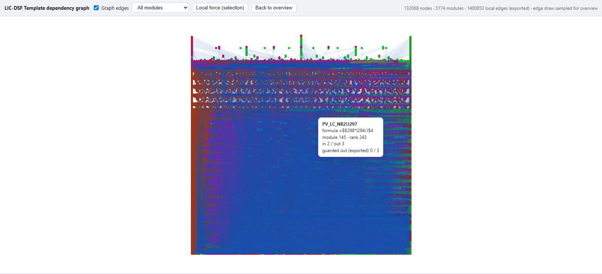

### GraphViz DOT

```python
from excel_grapher.grapher import to_graphviz

dot = to_graphviz(g, rankdir="LR")
```

### Mermaid

```python
from excel_grapher.grapher import to_mermaid

mm = to_mermaid(g, max_nodes=100)
```

### Path-induced subgraphs for focused visualization

Use `select_path_induced_subgraph(...)` to isolate only nodes on directed dependency paths between source and target node sets, then pass the smaller graph to any exporter.

```python
from excel_grapher.grapher import select_path_induced_subgraph, to_graphviz

focused = select_path_induced_subgraph(
    g,
    source_keys=["Sheet1!F1"],
    target_keys=["Sheet1!A1"],
    max_path_length=10,  # optional safety cutoff
    max_paths=1000,      # optional safety cutoff
)
dot = to_graphviz(focused, rankdir="LR")
```

The path search follows graph edge direction (`A -> B` means `A` depends on `B`), validates that all requested keys exist in the graph, and preserves edge guards/provenance in the returned induced subgraph.

### Shortest-path subgraphs

Use `select_shortest_path_subgraph(...)` to keep only nodes on the hop-shortest paths between two cells. Search is directed by default. Pass `directed=False` when the cells are not ancestor/descendant — for example two inputs that share a consumer:

```python
from excel_grapher.grapher import select_shortest_path_subgraph, to_graphviz

# A -> B and A -> C: no directed path B -> ... -> C
related = select_shortest_path_subgraph(
    g,
    source_key="Sheet1!B1",
    target_key="Sheet1!C1",
    directed=False,
)
dot = to_graphviz(related, rankdir="LR")
```

`directed` affects reachability only. The returned graph keeps original edge direction, guards, and provenance. If several paths share the shortest hop count, all of them are kept. A directed miss that still has an undirected path raises `ValueError` and mentions `directed=False`.

### NetworkX (optional dependency)

```python
from excel_grapher.grapher import to_networkx

G = to_networkx(g)
```

### Formula text on nodes

For `to_graphviz`, `to_mermaid`, and `to_networkx`, formula cells get a **second line** in the node label (cell address, then the formula). This is on by default (`include_formula_on_nodes=True`). Set `include_formula_on_nodes=False` to use only the cell address. Long formulas are truncated for display: `max_formula_length` defaults to `120` characters; use `None` for no limit. Truncated text ends with `...`.

### Large graphs and module inference: NetworkX visualization

For graphs that are too large for Graphviz or Mermaid, the current recommended workflow is:

- `DependencyGraph` -> `to_networkx(...)` -> `to_web_viz_payload(...)`
- `write_web_viz_html(...)` for rendering

This builds a NetworkX graph, converts it to a visualization payload, generates a static HTML viewer that wraps the payload, and opens the generated HTML in a browser. The payload stores node coordinates, module/rank metadata, and edge columns; the browser viewer consumes those directly.

```python
from pathlib import Path

from excel_grapher.exporter import to_web_viz_payload
from excel_grapher.grapher import create_dependency_graph, to_networkx, write_web_viz_html

g = create_dependency_graph("model.xlsx", ["Sheet1!A1"], load_values=False)
payload = to_web_viz_payload(to_networkx(g))
write_web_viz_html(payload, Path("model.html"), data_mode="auto")
```



#### Customizing NetworkX visualization

The payload builder (`to_web_viz_payload`) and the viewer (`write_web_viz_html`) are powered by plugins. A single default plugin is provided for each, but you are encouraged to write your own. Configure `to_web_viz_payload(...)` via:

- `layout="..."`: layout plugin id (`stratified_multipartite` default; see `list_web_viz_layouts()`).
- `layout_config={...}`: plugin-specific optional config.
- `include_guarded_edges`: include/exclude guarded edges in core/local edge export.
- `include_guarded_edges_for_partition`: include/exclude guarded edges in module partitioning.
- `include_module_overlay`: include partition overlay metadata and module color semantics.

#### Default layout: `stratified_multipartite`

The default layout is `stratified_multipartite`, which uses SCC-condensation longest-path rank on the vertical axis and Louvain community ordering on the horizontal axis.

```python
from excel_grapher.exporter import to_web_viz_payload, list_web_viz_layouts
from excel_grapher.grapher import write_web_viz_html

payload = to_web_viz_payload(
    G,
    layout="stratified_multipartite",  # default
    layout_config=None,                # plugin-specific options
    include_module_overlay=True,       # include Louvain partition overlay
)
write_web_viz_html(payload, "model-web.html", data_mode="auto")
```

This layout is partly intended to inform refactoring and modularization of generated code. Interpret the viewer with this mental model:

- **Position**: `x`/`y` - SCC-rank vertical strata and Louvain-based horizontal ordering.
- **Color**: node color maps to `module_id` (partition/community id). With no module overlay, all nodes are one module color.
- **Edges**: overview prefers node-level `local_edges`; if unavailable, it falls back to module-centroid edges.
- **Label `Module edges` / `Graph edges`**: reflects which edge set is currently drawn in overview.
- **Rank** in tooltip is node rank metadata and may differ from visual layering for force-directed layouts.

`excel_grapher.exporter.to_web_viz_payload(...)` includes the partition overlay by default and is the canonical payload entrypoint for this visualization workflow. Open the exported HTML directly in a browser. The interface supports panning, zooming, hover tooltips, and a local force-layout mode for inspecting a neighborhood around a selected node.

### Validation via `calcChain.xml`

You can validate the graph against Excel’s `calcChain.xml`:

```python
from pathlib import Path

from excel_grapher.grapher import create_dependency_graph, validate_graph

g = create_dependency_graph("model.xlsx", ["Sheet1!A10"], load_values=False)
res = validate_graph(g, Path("model.xlsx"), scope={"Sheet1"})
print(res.is_valid, res.messages)
```

If `xl/calcChain.xml` is missing (common for generated files), validation returns `is_valid=True` with an informational message.
